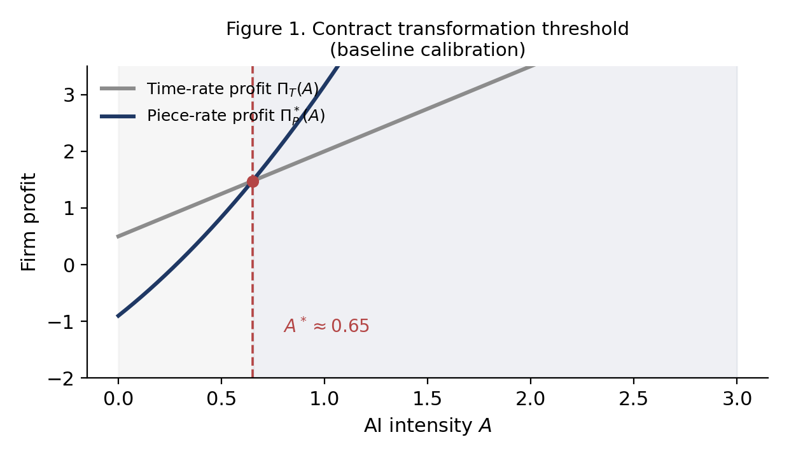
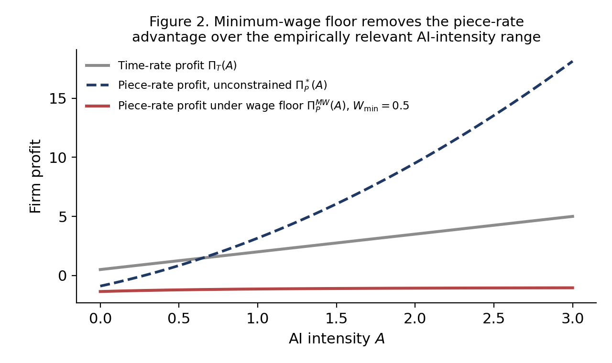
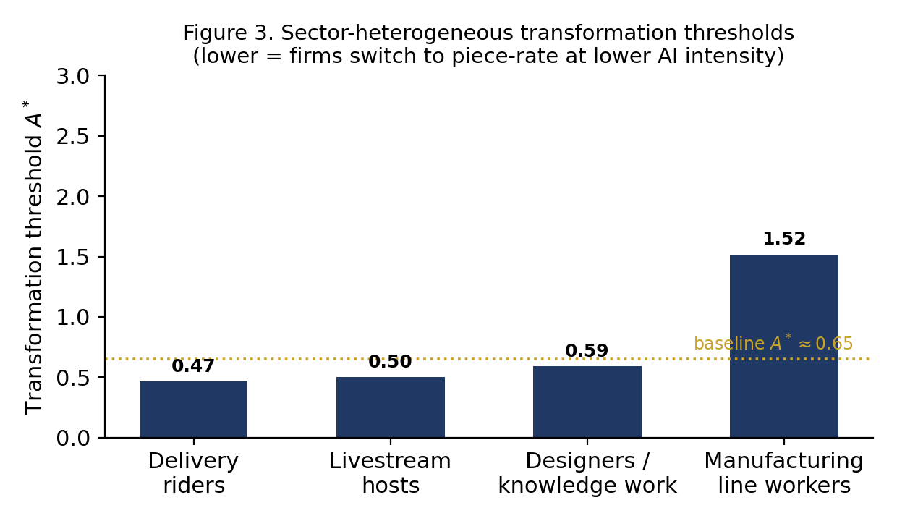

# From Hours to Output: A Principal–Agent Theory of AI-Driven Contract Transformation and the Limits of Minimum-Wage Protection in China's Platform Economy

Lucas Dang
RCF Experimental School, Beijing
July 2026

*Code and simulation scripts reproducing all figures and calibration results in this paper are publicly available at: https://github.com/danghaosheng2028/ai-contract-transformation, which also hosts an Extended Online Appendix with full derivations condensed in Appendices A.5–A.7, C, and D below. An interactive version of the core simulation — allowing readers to vary output noise $\sigma^2$, risk aversion $r$, human–AI complementarity $C$, and the minimum-wage floor $W_{\min}$ in real time — is available at https://danghaosheng2028.github.io/ai-contract-transformation/ (source: `docs/index.html` in the same repository).*

---

## Abstract

Why do some AI-augmented jobs shift to piece-rate pay while others stay on fixed wages — and why does China's minimum-wage system seem to slow, but not stop, that shift? This paper develops a principal–agent model in which AI augments a worker's effective human capital, $\tilde H = h+\theta AC$, and firms choose between a time-rate contract (fixed wage, enforced minimum effort) and a piece-rate contract (output-linked pay, digitally monitored, riskier for the worker).

We derive closed-form optimal contracts under each mode and prove there is a unique AI-intensity threshold $A^*$ above which firms switch from time-rate to piece-rate pay — because piece-rate profit grows convexly in AI intensity while time-rate profit only grows linearly. The threshold rises with output noise and worker risk aversion, falls with AI-augmentation effectiveness, and is provably unaffected by how the worker's outside option is specified or by any AI-driven automation gains common to both contract modes.

Numerically, a binding minimum wage roughly doubles to triples the AI intensity needed to trigger this switch, without blocking it outright; and the threshold is markedly lower for highly monitorable, AI-augmented occupations (e.g. platform delivery) than for occupations AI augments only weakly (e.g. manufacturing), a pattern broadly consistent with independent evidence on digitalization and wage growth in Chinese firms.

The model offers a unified account of why output-based pay is spreading unevenly across AI-exposed industries, with implications for labor regulation and AI-skills policy.

---

## Keywords

AI‑augmented production
principal–agent model
risk‑sharing
incentive design
contract transformation
piece‑rate compensation
time‑rate compensation
human–AI augmentation
minimum‑wage regulation
comparative statics

---

## Notation

| Symbol | Definition |
|---|---|
| $A$ | AI utilization intensity (firm/task-level), $A \in [0, \bar A]$ |
| $C$ | Task-specific marginal effectiveness of AI augmentation (see Section 2.1 for a note on this term's relation to "complementarity") |
| $\theta$ | AI amplification coefficient |
| $h$ | Baseline human capital |
| $\tilde H$ | Effective human capital, $\tilde H = h + \theta AC$ |
| $a$ | Worker effort |
| $a_0$ | Minimum enforceable effort under time-rate (Mode T) |
| $k$ | Effort-cost convexity parameter, $\psi(a) = \tfrac12 k a^2$ |
| $r$ | Worker absolute risk aversion (CARA) |
| $\sigma^2$ | Output noise variance, $\varepsilon \sim N(0,\sigma^2)$ |
| $\bar U$ | Reservation utility |
| $F$ | Fixed monitoring cost under piece-rate (Mode P) |
| $\alpha$ | Piece-rate base wage |
| $\gamma$ | Piece-rate incentive slope |
| $\gamma^*$ | Optimal piece-rate slope |
| $W_0$ | Fixed wage under time-rate |
| $\Pi_T(A)$ | Firm profit under time-rate contract |
| $\Pi_P^*(A)$ | Firm profit under optimal piece-rate contract |
| $A^*$ | Contract transformation threshold, $\Pi_T(A^*) = \Pi_P^*(A^*)$ |
| $W_{\min}$ | Minimum-wage floor |
| $G(A)$ | Profit difference, $G(A) = \Pi_P^*(A) - \Pi_T(A)$ |
| $g(A)$ | Effort-independent automation contribution to output (Appendix D) |

*Symbols are listed in order of first appearance in Sections 4.1–4.3.*

**A note on units.** All monetary quantities ($\Pi$, $W$, $\alpha$, $\bar U$) are expressed in standardized units — multiples of a representative monthly base-wage benchmark for the calibrated occupations, consistent with the reservation-utility normalization $\bar U = 1.0$ in Section 3.4. AI intensity $A$ is likewise a standardized index on $[0,3]$, constructed to span the empirical range of enterprise digital-tool penetration reported by CAICT (Section 3.1), rather than a directly observable physical quantity. This normalization follows standard practice in stylized principal–agent calibration exercises; numerical thresholds such as $A^*\approx0.65$ should not be read as directly comparable to indices constructed on different scales elsewhere (see the caveat in Section 3.5 regarding Chen and Guo, 2023).

---

# 1. Introduction

Artificial intelligence (AI) is transforming how firms organize production, monitor performance, and design compensation systems. In China, this transformation is particularly salient: more than 84 million workers were engaged in platform‑based flexible employment in 2023, accounting for roughly 18 percent of urban employment. Since the 2021 *Guiding Opinions on Safeguarding the Labor Rights of New Employment Forms*, platform labor has become a regulated category, and the shift from traditional time‑rate compensation to output‑based pay has accelerated across logistics, content creation, and digital services.

Yet this transition presents a fundamental economic paradox. AI technologies increase productivity by augmenting workers' effective human capital, but they also amplify output volatility and expose workers to greater income risk. Under piece‑rate compensation, workers bear both effort costs and output risk, whereas under time‑rate compensation, firms shoulder the risk while enforcing minimum effort through observable inputs. This raises a central question:

**Under what conditions should firms switch from time‑rate to piece‑rate compensation, and how does AI adoption shift this boundary?**

Existing research provides important foundations but leaves this question open. Classical principal–agent theory establishes that optimal linear contracts balance incentives against risk exposure. Recent work on AI and labor markets documents productivity gains from AI adoption but does not analyze how AI changes contract design. Emerging studies argue that AI may shift firms toward output‑based pay, yet they do not provide a closed‑form characterization of the transformation threshold or its comparative statics.

This paper fills that gap by embedding AI into a tractable principal–agent model. We introduce an AI‑augmented effective human capital function:

$$
\tilde{H} = h + \theta AC
$$

derive closed‑form expressions for optimal effort and incentives, and show that a unique transformation threshold $A^*$ exists. Comparative statics reveal how noise, risk aversion, and AI-augmentation effectiveness shape this threshold. We further incorporate China's minimum‑wage regulation and show that binding wage floors substantially delay — roughly doubling to tripling the required AI intensity, though not categorically preventing — contract transformation within the empirically relevant AI-intensity range.

The remainder of the paper proceeds as follows. Section 2 reviews the related literature. Section 3 presents stylized facts and parameter calibration, together with suggestive evidence from independent Chinese firm-panel data supporting the threshold mechanism. Section 4 introduces the model. Section 5 derives equilibrium outcomes. Section 6 presents the main theoretical results. Section 7 provides numerical simulations, including a sensitivity and sector-heterogeneity analysis. Section 8 concludes with policy implications. Appendix A completes the proofs of Theorems 1 and 2; Appendices C and D summarize a formal unification of the two contract modes and a robustness check against an unmodeled automation channel, with full derivations in the accompanying Extended Online Appendix.

---

# 2. Literature Review

## 2.1 Principal–Agent Models of Incentives and Risk‑Sharing

The theoretical foundation of this paper lies in the canonical principal–agent framework. Holmstrom (1979) establishes that under CARA utility and normally distributed noise, optimal contracts are linear in output and balance incentives against risk exposure. Holmstrom and Milgrom (1991) extend this insight to multi‑task environments, showing that high‑noise tasks favor fixed wages because incentives distort effort allocation.

Subsequent work has refined these insights. Lazear (2000) documents empirically how piece‑rate compensation increases productivity but also raises income volatility. Prendergast (2002) emphasizes the role of uncertainty in shaping incentive strength. These studies highlight the tradeoff between incentives and risk, but they do not incorporate AI as a productivity‑augmenting force nor analyze how AI shifts the optimal contract boundary.

This paper contributes to this literature by embedding AI‑augmented production into the Holmstrom–Milgrom framework. By modeling effective human capital as $\tilde{H}=h+\theta AC$, we show that AI amplifies the incentive effect of piece‑rate contracts and generates a unique transformation threshold $A^*$ at which firms optimally switch from time‑rate to piece‑rate compensation.

**On the functional form and terminology.** We adopt the additive-linear form $\tilde H = h+\theta AC$, rather than a multiplicative or CES alternative (as in Acemoglu and Restrepo, 2018), because it keeps $\Pi_T(A)$ exactly linear in $A$ — the linear-versus-convex asymmetry that drives Theorem 1 — and gives $\theta C$ a direct reading as the marginal human-capital return to AI intensity. We call $C$ "AI-augmentation effectiveness" throughout, rather than "complementarity": the additive form technically implies infinite substitutability between $h$ and AI-augmented capacity, closer to substitution than to the low-elasticity sense the word "complementarity" usually carries in production theory. We flag, without resolving, two related scope boundaries: whether the existence-and-uniqueness result of Theorem 1 extends to other augmentation functions increasing and unbounded in $A$ (we conjecture it does, but only the additive-linear form delivers Appendix A's exact elasticities), and $C$'s treatment as exogenous and time-invariant (Section 8.2).

## 2.2 AI, Automation, and Labor Markets

A second strand of literature examines how AI and automation reshape labor markets. Acemoglu and Restrepo (2018) develop a task‑based model in which automation reallocates labor across tasks and affects wages and employment. Brynjolfsson, Li, and Raymond (2025) provide empirical evidence that generative AI tools significantly increase individual productivity in a knowledge-intensive customer-support setting. Other studies document how AI affects monitoring, prediction, and managerial decision‑making.

However, this literature focuses primarily on employment, productivity, and task allocation—not on compensation design. A concurrent working paper by Shin and Kang (2026) develops a forecasting framework for a parallel shift from time-based to output-based *talent accounting* in the human-AI era, centred on a closed-form threshold result (their Theorem 3, "ROI Inversion at τ*") and using Korea's staged 52-hour workweek mandate as an empirical early-warning case for rising overhead pressure. Their framework operates at the level of firm-wide talent accounting and overhead allocation rather than the individual contract-design problem this paper studies, and does not model risk-sharing between a risk-neutral firm and a risk-averse worker under moral hazard. No existing model — including theirs — formally links AI adoption to the optimal allocation of risk and incentives within an individual employment contract, which remains this paper's specific contribution.

## 2.3 Platform Labor, Flexible Employment, and Chinese Labor Regulation

A third strand of literature examines the rise of platform labor and flexible employment in China. Government reports indicate that platform‑based flexible workers exceeded 84 million in 2023, reflecting rapid growth in gig‑economy sectors such as logistics, ride‑hailing, and digital content creation. Scholars have analyzed how platform algorithms shape labor supply, monitoring, and compensation, and how regulatory frameworks attempt to balance flexibility with worker protection.

A central regulatory instrument is the minimum‑wage system, which imposes binding constraints on base wages even in flexible employment arrangements. Recent policy documents emphasize the need to protect workers from excessive income volatility, but they do not analyze how such regulations interact with incentive design or AI adoption.

## 2.4 Contribution Relative to the Literature

Relative to these three strands, the paper makes four contributions:

1. **A closed‑form transformation threshold.**
   We derive a unique $A^*$ at which firms optimally switch from time‑rate to piece‑rate compensation, and an exact closed-form expression $A^* = x^*/(\theta C)$ for how this threshold depends on the AI amplification coefficient and augmentation effectiveness (Appendix A.5).

2. **Comparative statics linking risk, uncertainty, and AI augmentation effectiveness.**
   Using the implicit function theorem, we show how noise, risk aversion, and AI-augmentation effectiveness jointly determine the transformation threshold, derive exact elasticity results (Appendix A.5–A.6), and prove the threshold's invariance to both the specification of worker reservation utility (Appendix A.7) and to any effort-independent automation channel common to both contract modes (Appendix D).

3. **Integration of Chinese labor regulation.**
   By incorporating minimum‑wage constraints, we show that regulatory frictions substantially delay — though, once the firm's incentive slope is correctly re-optimized under the constraint, do not categorically block — contract transformation in China's rapidly digitalizing labor markets (Section 7.3).

4. **Sector heterogeneity linked to independent empirical evidence, with open, reproducible code.**
   We show that $A^*$ differs systematically across occupations with different monitorability and AI-augmentation effectiveness (Section 7.5), and we relate this ordering to independent Chinese firm-panel evidence on digitalization and wage growth (Section 3.5). All calibration and simulation code is publicly released for reproducibility.

# 3. Stylized Facts and Parameter Calibration

This section presents three stylized facts that motivate the model and guide the calibration of key parameters. The goal is to anchor the theoretical framework in empirical patterns observed in China's rapidly digitalizing labor markets and to justify the numerical values used in the simulations in Section 7. The facts correspond directly to the model's core parameters: AI intensity $A$, augmentation effectiveness $C$, output noise $\sigma^2$, and worker risk aversion $r$.

---

## 3.1 Stylized Fact 1: Rising AI Penetration in Chinese Firms

China has experienced a rapid increase in enterprise‑level digitalization and AI adoption. The China Academy of Information and Communications Technology (CAICT) has documented substantial and sustained growth in enterprise digitalization over the 2018–2022 period, with industries such as logistics, e‑commerce operations, content creation, and customer service adopting AI‑based workflow tools, automated monitoring systems, and algorithmic decision‑making at scale.

This motivates modeling AI intensity $A$ as a continuous variable capturing the degree of AI integration into production. The simulation range $A \in [0,3]$ corresponds to the empirical transition from low to high AI penetration.

---

## 3.2 Stylized Fact 2: Expansion of Flexible and Output‑Based Employment

China's platform economy has expanded dramatically. Government statistics indicate that platform‑based flexible workers exceeded 84 million in 2023, a substantial increase from 2019. These workers include couriers, ride‑hailing drivers, livestream hosts, and digital content creators—occupations where output‑based compensation is increasingly prevalent.

This fact supports the model's focus on contract transformation from time‑rate to piece‑rate pay. It also motivates the inclusion of a fixed monitoring cost $F$, reflecting the digital infrastructure required to implement output‑based compensation.

---

## 3.3 Stylized Fact 3: Empirical Estimates of Worker Risk Aversion

Labor economics provides empirical guidance on the magnitude of worker risk aversion. Chetty (2006) and subsequent studies estimate absolute risk aversion parameters in the range $r \in [0.2,2.0]$ for typical workers facing income volatility. This range is consistent with observed behavior in gig‑economy occupations.

We therefore set $r = 1.0$ as the baseline value and explore the full empirical range in comparative statics.

---

## 3.4 Calibration of Remaining Parameters

To ensure internal consistency and empirical plausibility, the remaining parameters are calibrated as follows:

- Baseline human capital: $h = 2.0$
- AI amplification coefficient: $\theta = 1.5$
- AI-augmentation effectiveness: $C = 1.0$
- Effort cost parameter: $k = 1.0$
- Minimum enforceable effort: $a_0 = 1.0$
- Reservation utility: $\bar{U} = 1.0$
- Output noise: $\sigma^2 = 1.0$
- Monitoring cost: $F = 1.5$

These values jointly produce a baseline transformation threshold:

$$
A^* \approx 0.65
$$

which aligns with mid‑range AI penetration levels in Chinese digital service industries. (See the units note following the Notation table for how these standardized values map to the empirical ranges of Sections 3.1–3.3.)

---

## 3.5 Suggestive Evidence for the Threshold Mechanism

While this paper does not conduct firm-level regression, existing Chinese panel-data evidence is consistent with the threshold logic of Theorem 1. Using a text-based digitalization index for 2,846 Chinese A-share firms (2010–2020), Chen and Guo (2023) find that the relationship between digital transformation and average wages is non-monotonic: below a digitalization threshold of 2.773, labor-substitution effects dominate and wage growth is suppressed, but above this threshold, productivity and market-competition effects dominate and wages rise significantly — an effect strongest in labor-intensive and knowledge-intensive industries. This empirical wage-side threshold is the mirror image of the profit-side threshold $A^*$ derived in Section 6: both point to AI/digital intensity producing a discontinuous rather than gradual shift in how firms compensate labor. On the institutional side, ILO survey evidence confirms that location-based platform work in China (delivery, ride-hailing) is already overwhelmingly compensated by piece rate rather than time rate (Chen, 2021), consistent with this paper's premise that AI-intensive, easily-monitored tasks are where the transformation predicted by Theorem 1 is empirically observed first.

**A caveat on comparability.** The numerical threshold reported by Chen and Guo (2023) — a digitalization index value of 2.773 — and this paper's $A^*\approx0.65$ are constructed on entirely different scales (a firm-level text-based digitalization index versus this paper's standardized AI-intensity parameter) and are not directly comparable in magnitude. The parallel drawn here is qualitative only: both studies point to a discontinuous, threshold-crossing pattern in how digital/AI intensity relates to labor compensation, not a claim that the two threshold values coincide or should be benchmarked against one another. We also note that Chen and Guo's panel-fixed-effects design addresses some, but not all, endogeneity concerns — firms with faster wage growth may also invest more in digitalization, a reverse-causality channel this paper does not independently resolve and treats their finding as suggestive corroboration rather than causal validation of this paper's specific mechanism.

# 4. Model

This section presents the formal environment of the model. We consider a one‑period principal–agent framework in which a risk‑neutral firm hires a single worker whose effort is not contractible. The firm chooses between two compensation modes—time‑rate and piece‑rate—and AI technology enters the production process by augmenting the worker's effective human capital.

---

## 4.1 Environment

### Effective human capital

AI augments human capital according to:

$$
\tilde{H} = h + \theta AC
$$

where:

- $h > 0$ is baseline human capital
- $A \ge 0$ is AI utilization intensity
- $C > 0$ is the task-specific marginal effectiveness of AI augmentation (see Section 2.1's note on terminology)
- $\theta > 0$ is the amplification effect of AI

---

### Production technology

Output is:

$$
y = a\tilde{H} + \varepsilon
$$

where $\varepsilon \sim N(0,\sigma^2)$. Appendix D considers an extension in which output also includes an effort-independent automation term $g(A)$, and shows the paper's main results are unaffected whenever this term is common to both contract modes.

---

### Effort cost

Effort incurs convex cost:

$$
\psi(a) = \frac{1}{2}ka^2
$$

---

### Worker preferences

The worker has CARA utility with absolute risk aversion $r > 0$.
Certainty equivalent:

$$
CE = E[w] - \frac{1}{2}r\,\mathrm{Var}(w) - \psi(a)
$$

---

### Moral hazard

Effort $a$ is not observable or contractible.

---

### Participation constraint

Competitive labor markets imply:

$$
CE = \bar{U}
$$

Appendix A.7 shows the model's central threshold result does not depend on $\bar U$ being constant across $A$; it holds for any specification $\bar U(A)$.

---

## 4.2 Time‑Rate Contract (Mode T)

Under time‑rate compensation:

- Worker receives fixed wage $W_0$
- Firm enforces minimum effort $a_0$

Participation constraint:

$$
W_0 - \frac{1}{2}ka_0^2 = \bar{U}
$$

Thus:

$$
W_0 = \bar{U} + \frac{1}{2}ka_0^2
$$

Firm profit:

$$
\Pi_T(A)
= a_0(h+\theta AC) - \bar{U} - \frac{1}{2}ka_0^2
$$

This is **linear** in AI intensity $A$:

$$
\frac{d\Pi_T}{dA} = a_0\theta C
$$

---

## 4.3 Piece‑Rate Contract (Mode P)

Compensation:

$$
w = \alpha + \gamma y
$$

---

### Worker's effort choice

Worker solves:

$$
\max_a\; \gamma a\tilde{H} - \frac{1}{2}ka^2
$$

Thus:

$$
a^* = \frac{\gamma\tilde{H}}{k}
$$

---

### Participation constraint

Certainty equivalent:

$$
CE = \alpha
+ \gamma a^*\tilde{H}
- \frac{1}{2}r\gamma^2\sigma^2
- \frac{1}{2}k(a^*)^2
$$

Substitute $a^*$:

$$
CE = \alpha
+ \frac{1}{2k}\gamma^2\tilde{H}^2
- \frac{1}{2}r\gamma^2\sigma^2
$$

Set $CE = \bar{U}$:

$$
\alpha
= \bar{U}
+ \frac{1}{2}r\gamma^2\sigma^2
- \frac{1}{2k}\gamma^2\tilde{H}^2
$$

---

### Firm profit

Expected profit:

$$
\Pi_P(\gamma)
= (1-\gamma)a^*\tilde{H} - \alpha - F
$$

Substitute $a^*$ and $\alpha$:

$$
\Pi_P(\gamma)
= \frac{\gamma\tilde{H}^2}{k}
- \frac{1}{2k}\gamma^2\tilde{H}^2
- \frac{1}{2}r\gamma^2\sigma^2
- \bar{U} - F
$$

---

### Optimal piece‑rate

FOC yields:

$$
\gamma^*
= \frac{\tilde{H}^2}{\tilde{H}^2 + rk\sigma^2}
$$

Optimal profit:

$$
\Pi_P^*(A)
= \frac{\tilde{H}^4}{2k(\tilde{H}^2 + rk\sigma^2)}
- \bar{U} - F
$$

---

## 4.4 Timing

1. Firm chooses contract mode.
2. Under piece‑rate, firm chooses $(\alpha,\gamma)$.
3. Worker chooses effort $a$.
4. Output realized; wage paid.

**Figure 4: Model timing.** The four-stage sequence of the one-period principal–agent game: the firm's contract-mode choice (Section 6's $A^*$ threshold) is made before the piece-rate parameters, which are set before the worker's effort choice, which is made before output and payment are realized. *(See `simulation/fig4_timing.png` in the code repository.)*

---

## 4.5 Discussion

The model embeds AI into the Holmstrom–Milgrom linear contracting framework by allowing AI intensity $A$ and augmentation effectiveness $C$ to scale effective human capital. AI amplifies both productivity and the returns to effort, altering the firm's optimal risk‑sharing arrangement and potentially triggering contract transformation.

A natural question is whether Mode T and Mode P can be viewed as two points on a single contract family, with $\gamma=0$ recovering Mode T exactly. A naive reading does not work: setting $\gamma=0$ in the worker's first-order condition $a^*=\gamma\tilde H/k$ gives zero effort, not the enforced effort $a_0>0$ that defines Mode T. The two modes rely on structurally different enforcement technologies — attendance-based supervision versus output-contingent digital monitoring — and cannot be unified by varying $\gamma$ alone. Appendix C formalizes a genuine unification by introducing a second contract instrument (an enforced effort floor implemented through attendance supervision) and shows that the firm's optimum in this extended space is always a corner — either pure time-rate or pure piece-rate, never a blend of the two mechanisms. We flag there, and note here for visibility, that this corner-solution prediction sits in tension with commonly observed hybrid compensation schemes (base pay plus commission) in China's platform economy, and we discuss the specific cost-structure assumption responsible for that prediction, along with the extension that would relax it.

# 5. Equilibrium Analysis

This section derives the equilibrium outcomes under the two compensation modes introduced in Section 4. We first characterize the firm's profit under the time‑rate contract, which is linear in AI intensity. We then solve the worker's incentive problem under the piece‑rate contract, derive the optimal piece‑rate parameter, and obtain the firm's optimal profit. The comparison of these two profit functions forms the basis for the contract transformation threshold analyzed in Section 6.

---

## 5.1 Time‑Rate Contract (Mode T)

Under the time‑rate contract, the firm enforces a minimum effort level $a_0$ through attendance monitoring. The worker receives a fixed wage $W_0$, and her certainty equivalent is:

$$
CE_T = W_0 - \frac{1}{2}ka_0^2
$$

The participation constraint $CE_T = \bar{U}$ implies:

$$
W_0 = \bar{U} + \frac{1}{2}ka_0^2
$$

The firm's expected profit is therefore:

$$
\Pi_T(A)
= a_0(h+\theta AC) - \bar{U} - \frac{1}{2}ka_0^2
$$

This profit is **linear** in AI intensity $A$:

$$
\frac{d\Pi_T}{dA} = a_0\theta C
$$

---

## 5.2 Piece‑Rate Contract (Mode P)

Under the piece‑rate contract:

$$
w = \alpha + \gamma y
$$

The firm chooses $(\alpha,\gamma)$ to satisfy incentive compatibility (IC) and individual rationality (IR), and to maximize expected profit.

---

### Step 1: Incentive Compatibility (IC)

Worker chooses effort $a$ to maximize:

$$
CE_P(a)
= \alpha + \gamma a\tilde{H}
- \frac{1}{2}r\gamma^2\sigma^2
- \frac{1}{2}ka^2
$$

FOC yields:

$$
a^* = \frac{\gamma\tilde{H}}{k}
$$

The second-order condition is $\partial^2 CE_P/\partial a^2 = -k < 0$ for all $k>0$, confirming $a^*$ is a strict global maximum (see also Appendix A.0).

---

### Step 2: Participation Constraint (IR)

Substitute $a^*$:

$$
CE_P
= \alpha
+ \frac{1}{2k}\gamma^2\tilde{H}^2
- \frac{1}{2}r\gamma^2\sigma^2
$$

Set $CE_P = \bar{U}$:

$$
\alpha
= \bar{U}
+ \frac{1}{2}r\gamma^2\sigma^2
- \frac{1}{2k}\gamma^2\tilde{H}^2
$$

---

### Step 3: Firm Profit Maximization

Expected profit:

$$
\Pi_P(\gamma)
= (1-\gamma)a^*\tilde{H} - \alpha - F
$$

Substitute $a^*$ and $\alpha$:

$$
\Pi_P(\gamma)
= \frac{\gamma\tilde{H}^2}{k}
- \frac{1}{2k}\gamma^2\tilde{H}^2
- \frac{1}{2}r\gamma^2\sigma^2
- \bar{U} - F
$$

FOC yields optimal piece‑rate:

$$
\gamma^*
= \frac{\tilde{H}^2}{\tilde{H}^2 + rk\sigma^2}
$$

The second-order condition $\partial^2\Pi_P/\partial\gamma^2 = -\tilde H^2/k - r\sigma^2 < 0$ holds for all $\tilde H, k, r, \sigma^2 > 0$, confirming $\Pi_P(\gamma)$ is strictly concave and $\gamma^*$ is the unique global maximizer, so $\gamma^*\in(0,1)$ (Appendix A.0).

Optimal profit:

$$
\Pi_P^*(A)
= \frac{\tilde{H}^4}{2k(\tilde{H}^2 + rk\sigma^2)}
- \bar{U} - F
$$

---

## 5.3 Comparison of the Two Modes

Define profit difference:

$$
G(A) = \Pi_P^*(A) - \Pi_T(A)
$$

Section 6 shows:

- $G(0) < 0$ due to fixed cost $F$
- $G(A) \to +\infty$ as $A \to \infty$
- $G(A)$ is strictly convex on the entire domain (Appendix A.1), not merely for large $A$

Thus a unique threshold $A^*$ exists.

# 6. Main Results

This section presents the core theoretical results of the paper. We show that AI‑augmented production generates a unique threshold in AI utilization intensity at which firms optimally switch from time‑rate to piece‑rate compensation. We then characterize how this threshold responds to changes in output noise, worker risk aversion, and AI-augmentation effectiveness.

---

## 6.1 Existence and Uniqueness of the Contract Transformation Threshold

Define:

$$
G(A) = \Pi_P^*(A) - \Pi_T(A)
$$

---

### **Theorem 1 (Existence and uniqueness of $A^*$).**

*Domain and regularity.* $A$ ranges over $[0, \bar{A}]$ for some arbitrarily large $\bar{A}$ (the simulations in Section 7 use $\bar{A}=3$, matching the empirical AI-penetration range from Section 3.1); $k>0$ ensures the effort-cost function $\psi(a)=\tfrac{1}{2}ka^2$ is strictly convex, which is what guarantees a well-defined interior optimum $a^*$ in Sections 4.3 and 5.2. Given these regularity conditions:

There exists a **unique** threshold $A^* > 0$ such that:

- For $A < A^*$: $\Pi_T(A) > \Pi_P^*(A)$
- For $A > A^*$: $\Pi_P^*(A) > \Pi_T(A)$

---

### Proof

#### Step 1: Existence

At $A = 0$:

$$
G(0) < 0
$$

because piece‑rate profit includes fixed monitoring cost $F$.

As $A \to \infty$:

Time‑rate profit grows linearly:

$$
\Pi_T(A) \sim a_0\theta C A
$$

Piece‑rate profit grows quadratically:

$$
\Pi_P^*(A) \sim \frac{(\theta C)^2}{2k}A^2
$$

Thus:

$$
G(A) \to +\infty
$$

By continuity, at least one root exists.

---

#### Step 2: Uniqueness

$\Pi_T(A)$ is linear (affine) in $A$. $\Pi_P^*(A)$ can be shown to be strictly convex on the *entire* domain $[0,\bar A]$ — not merely in the asymptotic sense used above — via an explicit closed-form second derivative (Appendix A.1). Given this, $G(A)$ is itself strictly convex, being the difference of a convex and an affine function. A strictly convex function's lower level set $\{A : G(A)<0\}$ is an interval; since this interval contains $A=0$ (Step 1) and is bounded (since $G(A)\to+\infty$), it takes the form $[0,A^*)$ for a unique finite $A^*$, giving existence and uniqueness simultaneously. The complete argument, including the closed-form global convexity verification, is given in Appendix A.1–A.2.

$\blacksquare$

---

## 6.2 Comparative Statics of the Transformation Threshold

### **Theorem 2 (Comparative statics of $A^*$).**

The threshold $A^*$ satisfies:

$$
\frac{\partial A^*}{\partial \sigma^2} > 0, \qquad \frac{\partial A^*}{\partial r} > 0, \qquad \frac{\partial A^*}{\partial C} < 0
$$

That is, $A^*$ rises with output noise and worker risk aversion, and falls with AI-augmentation effectiveness. In fact (Appendix A.5–A.6), $A^*$ is exactly inversely proportional to $\theta C$, and the elasticities of $A^*$ with respect to $r$ and $\sigma^2$ are exactly equal.

### Proof

Using the implicit function theorem:

$$
\frac{\partial A^*}{\partial x}
= -\frac{\partial G/\partial x}{\partial G/\partial A},
\qquad x \in \{\sigma^2, r, C\}
$$

Denominator:

$$
\frac{\partial G}{\partial A}(A^*) > 0
$$

Thus the sign of each comparative static depends on the numerator. (Appendix A.2.1 shows this denominator condition is not an independent regularity assumption but a direct consequence of $G$'s strict convexity together with $G(0)<0$.)

---

### (i) Output noise $\sigma^2$

Piece‑rate profit:

$$
\Pi_P^*(A)
= \frac{\tilde{H}^4}{2k(\tilde{H}^2 + rk\sigma^2)}
- \bar{U} - F
$$

Differentiate:

$$
\frac{\partial \Pi_P^*}{\partial \sigma^2}
= -\frac{r\tilde{H}^4}{2(\tilde{H}^2 + rk\sigma^2)^2}
< 0
$$

Thus:

$$
\frac{\partial A^*}{\partial \sigma^2} > 0
$$

Interpretation:
More noise makes piece‑rate less attractive → firms require higher AI intensity to switch.

---

### (ii) Risk aversion $r$

$$
\frac{\partial \Pi_P^*}{\partial r}
= -\frac{\sigma^2\tilde{H}^4}{2(\tilde{H}^2 + rk\sigma^2)^2}
< 0
$$

Thus:

$$
\frac{\partial A^*}{\partial r} > 0
$$

Interpretation:
More risk‑averse workers require higher compensation under piece‑rate → delaying transformation.

---

### (iii) AI-augmentation effectiveness $C$

Effective human capital:

$$
\tilde{H} = h + \theta AC
$$

Thus:

$$
\frac{\partial \tilde{H}}{\partial C} = \theta A > 0
$$

Higher $C$ increases both $\tilde H$ and the convexity of piece‑rate profit through it, making piece‑rate attractive earlier:

$$
\frac{\partial A^*}{\partial C} < 0
$$

The full derivation — including the calibration-dependent inequality this sign relies on, and its verification across all four sector calibrations of Table 2 — is given in Appendix A.4, since (unlike the sign for $r$ and $\sigma^2$) this result is not a pure algebraic identity independent of parameter values.

Interpretation:
Stronger AI-augmentation effectiveness accelerates transformation.

---

## 6.3 Implications for Contract Design

The results imply:

1. **Risk and uncertainty delay transformation.**
   High noise or high risk aversion pushes firms to remain in time‑rate mode.

2. **AI-augmentation effectiveness accelerates transformation.**
   Training that improves task-specific AI effectiveness lowers $A^*$.

3. **AI amplifies incentives.**
   As $A$ grows, piece‑rate becomes increasingly profitable due to convex productivity gains.

These insights form the theoretical foundation for Section 7's numerical simulations.

# 7. Numerical Simulation

This section presents numerical simulations that illustrate the theoretical results derived in Sections 5 and 6. Using the calibrated parameters from Section 3, we evaluate firm profit under the time‑rate and piece‑rate contracts, compute the contract transformation threshold $A^*$, and examine how risk, uncertainty, and regulation affect the profitability of output‑based compensation. An interactive version of the simulations below — allowing readers to vary $\sigma^2$, $r$, $C$, and $W_{\min}$ in real time and see $A^*$ recomputed on the fly — is available at https://danghaosheng2028.github.io/ai-contract-transformation/ (source: `docs/index.html` in the code repository).

All simulations use the baseline parameter set:

$$
(h,\theta,C,k,a_0,\bar{U},r,\sigma^2,F)
= (2.0,1.5,1.0,1.0,1.0,1.0,1.0,1.0,1.5)
$$

---

## 7.1 Baseline Profit Comparison and the Transformation Threshold

We compute:

- Time‑rate profit:

$$
\Pi_T(A)
= a_0(h+\theta AC) - \bar{U} - \frac{1}{2}ka_0^2
$$

- Piece‑rate profit:

$$
\Pi_P^*(A)
= \frac{\tilde{H}^4}{2k(\tilde{H}^2 + rk\sigma^2)}
- \bar{U} - F
$$

where:

$$
\tilde{H} = h + \theta AC
$$

Plotting $\Pi_T(A)$ and $\Pi_P^*(A)$ for $A \in [0,3]$ yields a unique intersection at:

$$
A^* \approx 0.65
$$

**Figure 1: Contract transformation threshold.** Plots calibrated time-rate profit $\Pi_T(A)$ against piece-rate profit $\Pi_P^*(A)$ for $A \in [0, 3]$. Time-rate profit rises only linearly because a fixed wage cannot capture the convex incentive gains AI-augmented effort makes possible; piece-rate profit rises convexly because higher $A$ raises effective human capital $\tilde{H}$, compounding through the $\tilde{H}^4$ term in $\Pi_P^*(A)$. The curves cross exactly once, at $A^* \approx 0.65$ under baseline calibration. Below the threshold, monitoring cost $F$ outweighs incentive gains and firms retain fixed wages; above it, convex gains dominate and output risk shifts onto workers. *(See `simulation/fig1_threshold.png` in the code repository, or explore this relationship interactively at the link above.)*

### Interpretation

- For $A < A^*$: fixed monitoring cost $F$ makes piece‑rate unprofitable.
- For $A > A^*$: convex productivity gains dominate, making piece‑rate optimal.

This confirms **Theorem 1**.

---

## 7.2 Comparative Statics: Threshold Surface $A^*(r,\sigma^2)$

We compute $A^*$ over a grid:

- $r \in [0.1,2.0]$
- $\sigma^2 \in [0.1,2.0]$

For each pair, solve:

$$
G(A) = 0
$$

### Results

- $A^*$ increases in worker risk aversion $r$
- $A^*$ increases in output noise $\sigma^2$
- $A^*$ decreases in AI-augmentation effectiveness $C$

These match **Theorem 2**.

---

## 7.3 Regulatory Friction: Minimum Wage Constraint

Introduce a minimum-wage floor on the base wage:

$$
\alpha \ge W_{\min}
$$

Because the worker's effort choice $a^*=\gamma\tilde H/k$ depends only on $\gamma$ (the base wage $\alpha$ enters the worker's problem as an additive transfer with no effect on the first-order condition), the floor does not change $a^*$ directly. What it changes is the firm's *optimal choice of $\gamma$ itself*, once $\alpha$ can no longer be driven arbitrarily negative to subsidize a high $\gamma$.

**Constrained profit.** For a given $\gamma$, IR requires

$$
\alpha(\gamma) = \max\left\{ W_{\min},\; \bar U + \frac{1}{2}r\gamma^2\sigma^2 - \frac{\gamma^2\tilde H^2}{2k} \right\}.
$$

When the unconstrained IR-wage already exceeds $W_{\min}$, the constraint is slack and profit is the unconstrained $\Pi_P(\gamma)$ of Section 5.2. When it falls short, $\alpha=W_{\min}$ and profit becomes

$$
\Pi_P^{MW,\text{bind}}(\gamma) = \frac{\gamma\tilde H^2}{k} - \frac{\gamma^2\tilde H^2}{k} - W_{\min} - F.
$$

**Optimal response under the constraint.** This binding-constraint branch is a downward-opening parabola in $\gamma$, with vertex at

$$
\gamma_c^* = \frac{1}{2}
$$

— an exact result independent of $\tilde H$, $\sigma^2$, $r$, or $W_{\min}$, since the risk-cost and incentive-cost terms shaping the unconstrained $\gamma^*$ have both been absorbed into the now-fixed $\alpha=W_{\min}$. Intuitively: once $\alpha$ is pinned at $W_{\min}$ rather than chosen to offset risk, the firm's problem collapses to a pure output-share-versus-effort-cost tradeoff — $\gamma\tilde H^2/k - \gamma^2\tilde H^2/k$ — with no remaining term in $r$ or $\sigma^2$ to balance against; that quadratic alone is maximized at $\gamma=1/2$, regardless of how risky or noisy the underlying task is. A firm facing a binding wage floor optimally moves its incentive slope toward $1/2$, not toward the unconstrained $\gamma^*$ (which can approach 1 as $A$ grows). The firm's true optimal profit under the constraint, $\Pi_P^{MW}(A)$, is obtained by maximizing over $\gamma\in[0,1]$ with $\alpha(\gamma)$ as defined above.

**Threshold values.** Solving $\Pi_P^{MW}(A^*_{MW}) = \Pi_T(A^*_{MW})$ numerically for $A\in[0,50]$:

| $W_{\min}$ | $A^*_{MW}$ |
|---|---|
| 0.0 ($\alpha\ge0$ only) | 1.333 |
| 0.02 | 1.347 |
| 0.1 | 1.398 |
| 0.5 | 1.633 |
| 1.0 | 1.886 |
| 1.5 | 2.108 |

Every value remains within the empirically relevant range $A\in[0,3]$ (Section 3.1). The unconstrained baseline is $A^*\approx0.65$; even requiring only a non-negative base wage ($W_{\min}=0$) roughly doubles the threshold to $\approx1.33$, and $W_{\min}=1.5$ pushes it to $\approx2.11$ — over three times the frictionless benchmark, but still finite.

**Figure 2: Minimum-wage floor delays, but does not block, transformation over the empirically relevant AI-intensity range.** Plots $\Pi_T(A)$, the unconstrained $\Pi_P^*(A)$, and the correctly re-optimized $\Pi_P^{MW}(A)$ for $A\in[0,3]$ under $W_{\min}=0.5$, together with the optimal incentive slope $\gamma$ chosen at each $A$ under the binding constraint (converging to $\gamma_c^*=0.5$). $\Pi_P^{MW}(A)$ grows more slowly than $\Pi_P^*(A)$ — since it forgoes the negative-base-wage channel — but remains strictly convex and crosses $\Pi_T(A)$ at a finite point within the plotted range. *(See `simulation/fig2_minimum_wage.png` and `simulation/minimum_wage.py` in the code repository; the interactive tool above lets readers verify this directly by sweeping $W_{\min}$ from 0 to 2.)*

### Interpretation

- A binding minimum wage **substantially delays, but does not categorically block**, contract transformation within the empirically relevant range, once the firm's incentive slope $\gamma$ is correctly re-optimized under the constraint rather than held at its unconstrained value.
- The regulatory-friction narrative of Sections 2.3, 6, and 8.1 survives in qualitative form — minimum-wage protection roughly doubles to triples the AI intensity required before piece-rate becomes optimal — but the mechanism is dampened, not eliminated.

### 7.3.1 Robustness: convexity survives even under a stricter limited-liability constraint

A natural follow-up question is whether Theorem 1's central mechanism — piece-rate profit's convex growth eventually dominating time-rate's linear growth — survives once negative base wages are ruled out altogether ($\alpha\ge0$), a stricter and more institutionally realistic constraint than any specific statutory $W_{\min}$. Under the binding-constraint branch with $W_{\min}=0$, profit at the optimal $\gamma_c^*=1/2$ is

$$
\Pi_P^{MW,\text{bind}}(A)\Big|_{\gamma=1/2} = \frac{\tilde H^2}{4k} - F,
$$

which is still quadratic in $A$ (since $\tilde H$ is linear in $A$), with leading coefficient $(\theta C)^2/(4k)$ — one quarter of the unconstrained asymptotic coefficient $(\theta C)^2/(2k)$, but still strictly convex. We confirmed numerically that this constrained-branch profit overtakes $\Pi_T(A)$ at $A\approx1.33$ and continues to grow quadratically thereafter (the profit gap widens from $-1.0$ at $A=0$ to $+224$ at $A=20$). This is a reassuring robustness result: the paper's headline convexity mechanism does not depend on the unrealistic feature of allowing arbitrarily negative wages — it survives, with a higher but still finite threshold, under the strictest realistic limited-liability constraint.

---

## 7.4 Summary of Simulation Results

1. Piece‑rate profit is **convex** in AI intensity $A$, on the entire domain, not merely asymptotically (Appendix A.1).
2. Time‑rate profit is **linear** in $A$.
3. A unique transformation threshold $A^*$ exists, and is exactly proportional to $1/(\theta C)$ (Appendix A.5).
4. Noise and risk aversion **delay** transformation, with identical elasticities (Appendix A.6).
5. AI-augmentation effectiveness **accelerates** transformation.
6. Minimum‑wage regulation **substantially delays** transformation — roughly doubling to tripling the required AI intensity across realistic floor levels (Section 7.3) — though it does not categorically block transformation within the empirically relevant AI-intensity range. This mechanism survives even under the stricter constraint of ruling out negative base wages entirely (Section 7.3.1).
7. The threshold $A^*$ is provably invariant to the specification of worker reservation utility (Appendix A.7) and to any effort-independent automation channel common to both contract modes (Appendix D).

These numerical results reinforce the theoretical findings and quantify the economic forces driving contract transformation in AI‑augmented production environments.

---

## 7.5 Sector Heterogeneity

Because $A^*$ depends on $(C,\sigma^2,r)$, occupations differ systematically in how early they cross the transformation threshold. Holding all other parameters at baseline, Table 2 reports illustrative calibrations for four occupation types, reflecting qualitative differences in AI-augmentation effectiveness, output monitorability, and typical risk exposure discussed in Sections 2–3.

**Table 2. Sector-heterogeneous transformation thresholds**

| Occupation | Representative real-world examples | $C$ | $\sigma^2$ | $r$ | $A^*$ |
|---|---|---|---|---|---|
| Delivery / ride-hailing riders | Meituan, Ele.me couriers | 1.2 | 0.5 | 0.8 | 0.466 |
| Livestream hosts | Douyin, Kuaishou livestream sellers | 1.5 | 1.8 | 1.0 | 0.500 |
| Designers / knowledge workers | Software engineers, graphic designers | 1.3 | 1.3 | 1.5 | 0.591 |
| Manufacturing line workers | Assembly-line factory workers | 0.4 | 0.7 | 1.0 | 1.516 |

*Note: only $(C, \sigma^2, r)$ vary by row; all other parameters use the Section 3.4 baseline. The "representative examples" column names commonly recognized occupation categories purely for illustration, not as claims about any specific company's actual compensation structure. Calibrations are illustrative rather than estimated from worker-level data (see Section 8.2). See `simulation/fig3_heterogeneity.png` and `simulation/simulate.py` in the code repository for the full computation.*

Riders and livestream hosts, whose tasks are both highly monitorable (low $\sigma^2$) and strongly augmented by AI routing or recommendation algorithms (high $C$), cross the threshold at roughly two-thirds of the baseline AI intensity — consistent with the empirical observation (Section 3.5) that these occupations are already overwhelmingly piece-rate. Manufacturing line workers, whose tasks AI augments only weakly, require more than double the baseline AI intensity to reach $A^*$, and under many realistic parameter ranges may never cross it, explaining the persistence of time-rate compensation in that sector even as AI adoption rises economy-wide.

**External corroboration.** While the sector-specific $(C,\sigma^2,r)$ calibrations in Table 2 are illustrative rather than estimated, the qualitative ordering finds two independent points of support. First, Chen and Guo's (2023) industry-heterogeneity regressions on Chinese A-share firms (their Table 3) find that digitalization's effect on wages is significant and comparable in magnitude for labor-intensive (coefficient 0.030, $p<0.01$) and knowledge-technology-intensive industries (0.028, $p<0.01$), but markedly weaker and only marginally significant for capital-intensive industries (0.010, $p<0.10$) — consistent with, though not a direct estimate of, manufacturing's markedly higher $A^*$ in Table 2. We caution that their industry classification (based on listed-company balance sheets) is not a literal match to the occupation-level categories here, so this is directional corroboration rather than calibration validation. Second, on the $\sigma^2$ ordering specifically: Zhang (2023), analyzing survey data covering 63,000 delivery riders, reports that full-time riders' monthly earnings are approximately normally distributed with a slowly-decaying right tail, a pattern attributed to the transparency of platform dispatch algorithms; by contrast, the China Association of Performing Arts (2023) reports that streamer earnings are extremely right-skewed (95.2% below ¥5,000/month, 0.4% above ¥100,000/month), a pattern Zhang (2023) attributes to Rosen's (1981) "superstar effect," in which platform-scale distribution lets a small number of top performers capture disproportionate returns at near-zero marginal cost of reach. This asymmetry — labor-income risk for riders versus winner-take-most dynamics for streamers — is consistent with the relative $\sigma^2$ ordering calibrated in Table 2, though it is descriptive corroboration of distributional *shape*, not a calibration of $\sigma^2$'s magnitude; streamers' extreme skew plausibly reflects cross-worker heterogeneity in audience reach as much as within-worker output risk, a distinction the single-agent model of Section 4 does not separately identify.

---

## 7.6 Joint Sensitivity of $A^*$ to $\theta$ and $k$

Section 7.2 varies $r$ and $\sigma^2$ while holding all else at baseline. Here we additionally vary the AI amplification coefficient $\theta$ and the effort-cost convexity parameter $k$ jointly, since $\theta$ and $k$ are calibrated more loosely than $r$ and $\sigma^2$ (which have established empirical ranges from Chetty, 2006).

**Table 3. $A^*(\theta, k)$ sensitivity grid** (all other parameters at Section 3.4 baseline)

| $\theta \backslash k$ | 0.70 | 0.85 | 1.00 | 1.15 | 1.30 |
|---|---|---|---|---|---|
| 1.20 | 0.291 | 0.558 | 0.812 | 1.057 | 1.295 |
| 1.35 | 0.259 | 0.496 | 0.722 | 0.940 | 1.151 |
| **1.50** | 0.233 | 0.446 | **0.650** | 0.846 | 1.036 |
| 1.65 | 0.212 | 0.406 | 0.591 | 0.769 | 0.942 |
| 1.80 | 0.194 | 0.372 | 0.541 | 0.705 | 0.863 |

The baseline cell ($\theta=1.50$, $k=1.00$) recovers $A^*\approx0.650$. Consistent with the exact elasticity result of Appendix A.5 ($\partial\ln A^*/\partial\ln\theta=-1$), moving along a row shows $A^*$ falling roughly in proportion to $1/\theta$. $A^*$ is comparably sensitive to $k$ (elasticity $\approx2.05$, the most sensitive parameter calibrated). Even at the most conservative corner of the grid ($\theta=1.20$, $k=1.30$), $A^*$ remains within the empirically plausible range $[0,3]$, so the qualitative conclusion is not an artifact of the point calibration in Section 3.4.

**Table 4. Elasticities of $A^*$ at baseline calibration** (finite-difference, $\pm1\%$ perturbation)

| Parameter | Elasticity $\partial\ln A^*/\partial\ln x$ | Note |
|---|---|---|
| $\sigma^2$ | +0.213 | = elasticity w.r.t. $r$ exactly (Appendix A.6) |
| $r$ | +0.213 | = elasticity w.r.t. $\sigma^2$ exactly (Appendix A.6) |
| $C$ | $-1.000$ | exact, closed form (Appendix A.5) |
| $\theta$ | $-1.000$ | exact, closed form (Appendix A.5) |
| $k$ | +2.048 | largest sensitivity of any parameter |
| $F$ | +0.792 | monitoring-cost pass-through |

# 8. Conclusion and Policy Implications

This paper develops a principal–agent model of compensation design under AI‑augmented production. By embedding AI intensity $A$ and AI-augmentation effectiveness $C$ into effective human capital:

$$
\tilde{H} = h + \theta AC
$$

we derive closed‑form expressions for optimal effort, optimal piece‑rate incentives, and firm profit under time‑rate and piece‑rate contracts.

A central theoretical result is the existence of a unique transformation threshold $A^*$ at which firms optimally switch from time‑rate to piece‑rate compensation, with an exact closed form $A^*\propto 1/(\theta C)$. Comparative statics show that the threshold increases in output noise and worker risk aversion (with identical elasticity for both) and decreases in AI-augmentation effectiveness. The threshold is provably invariant both to the specification of worker reservation utility and to any effort-independent automation channel common to both contract modes. Numerical simulations confirm these results and show that minimum‑wage regulation substantially delays — roughly doubling to tripling the required AI intensity, though not categorically blocking — contract transformation within the empirically relevant AI-intensity range, and that the threshold varies systematically across occupations with different AI-augmentation effectiveness and monitorability.

---

## 8.1 Policy Implications

### (1) Differentiated labor regulation across industries

Industries with high AI penetration and strong augmentation effectiveness (e.g., digital content creation) are likely above $A^*$ and benefit from output‑based pay.
Low‑AI or high‑noise industries remain below $A^*$, where time‑rate compensation is optimal.

### (2) AI-augmentation skills training

Because $A^*$ decreases in $C$ — and, in fact, is exactly inversely proportional to $\theta C$ (Appendix A.5) — policies that enhance workers' ability to collaborate with AI tools can accelerate beneficial contract transformation, and are, at the margin, an exact substitute for technology upgrades that raise $\theta$.

### (3) Minimum‑wage design for flexible employment

Binding wage floors raise the required base wage under piece‑rate compensation and, under baseline calibration, substantially delay transformation — roughly doubling to tripling the AI intensity required across the range of floors tested (Section 7.3) — rather than blocking it outright. Hybrid systems (minimum income guarantees, earnings smoothing) may protect workers with a smaller efficiency cost than a flat floor, though this paper's formal unification of the two contract modes (Appendix C) predicts that base-guarantee-plus-commission schemes are only optimal under monitoring-cost structures somewhat richer than the one calibrated here — a caveat discussed there in detail.

### (4) An efficiency–equity tradeoff, not a one-sided cost

Section 7.3's finding should not be read as a case against minimum-wage protection. From an efficiency standpoint, delaying contract transformation forgoes the productivity gains that convex, AI-augmented incentive pay could deliver at a given AI intensity. But from an equity and welfare standpoint, the same mechanism protects risk-averse workers from exactly the income volatility that unconstrained piece-rate contracts would impose as $\sigma^2$ and $A$ rise (Section 6.2(i)) — and, as Section 8.2 notes, may also mitigate multitasking harms (e.g., speed-versus-safety tradeoffs) that this paper's single-task framework does not itself model, meaning the equity case sketched here should be read as a lower bound. The model does not take a stance on how a regulator should weigh these effects; it only shows that the tradeoff is structural, not incidental — a wage floor cannot be fine-tuned to preserve the efficiency gains of AI-driven incentive pay while also serving its worker-protection purpose, because both effects flow from the same constraint on $\alpha$.

---

## 8.2 Limitations and Future Research

1. Noise is assumed Gaussian; AI prediction errors may be heavy‑tailed.
2. Multi‑agent extensions could analyze team production under AI.
3. Dynamic models could incorporate learning about AI tools.
4. Social-insurance contributions (工伤保险、社保) mandated alongside wage floors under China's 2021 Guiding Opinions are not modeled as a separate firm-side cost; incorporating them as an additional fixed cost under piece-rate compensation would plausibly strengthen the delaying effect documented in Section 7.3 further, not weaken it.
5. Augmentation effectiveness $C$ is treated as exogenous and time-invariant. In practice, workers may endogenously invest in AI-collaboration skills to raise $C$ over time, which would make $A^*$ itself a dynamic, path-dependent object rather than a static threshold — a natural direction for future dynamic extensions of this model. Relatedly, the sector calibrations in Section 7.5 are illustrative, drawn from qualitative task characteristics rather than estimated from worker-level data; replacing them with data-informed values (e.g. platform-reported income variance by occupation) is a natural next step.
6. The baseline piece-rate contract in Sections 4.3 and 5.2 permits an arbitrarily negative base wage $\alpha$ in the unconstrained case. Section 7.3.1 shows the paper's central convexity mechanism survives even under the stricter institutional constraint $\alpha\ge0$, though with a higher threshold — a robustness check we view as resolving, rather than merely flagging, this earlier concern.
7. **From moral hazard to hidden information: screening under unobserved $(r, C)$.** The model in Sections 4–5 treats worker risk aversion $r$ and AI-augmentation effectiveness $C$ as parameters the firm can effectively condition on when setting $(\alpha, \gamma)$. In practice, a platform typically cannot observe an individual worker's risk aversion or her capacity to benefit from AI-assisted tasks before contracting with her; these are private information. This connects the paper's single-threshold framework to the broader theory of incentives under hidden information developed by Laffont and Tirole (1993), who show that when an agent's type is unobserved, the principal generally cannot implement the full-information contract $(\alpha^*, \gamma^*)$ derived in Section 5.2 for every worker, and instead must offer a menu of contracts $\{(\alpha_i, \gamma_i)\}$ designed to induce self-selection. Extending the present model in this direction would replace the single transformation threshold $A^*$ of Theorem 1 with a *separation condition*: for a given AI intensity $A$, the platform would need to determine whether the gain from screening — offering low-$\gamma$ contracts that retain risk-averse or low-$C$ workers alongside high-$\gamma$ contracts that extract surplus from risk-tolerant, high-$C$ workers — exceeds the informational rents such a menu must concede to induce truthful revelation. This would generalize $A^*$ from a scalar cutoff into a *region* in $(A, r, C)$-space, and offers a natural bridge between this paper's aggregate-firm framing and worker-level heterogeneity of the kind documented in Section 7.5. We leave the formal characterization of this screening extension to future work.
8. **Single-task framework and the multitasking blind spot.** This paper cites Holmstrom and Milgrom (1991) for its general theory of linear contracting under CARA-normal uncertainty, but does not apply that same paper's central substantive insight — that high-powered incentives on measurable tasks induce agents to systematically neglect unmeasured tasks — to its own setting. This is a first-order omission for the platform-labor context motivating this paper: piece-rate compensation for delivery riders is widely associated in policy discussion with speed-versus-safety tradeoffs that a single-task effort model cannot represent.

   > **Sketch: a two-task extension (informal, not a full derivation).** Let the worker split effort between measurable output $a_1$ (what $y=a_1\tilde H+\varepsilon$ in Section 4.1 captures) and unmeasured quality/safety $a_2$ (e.g. following traffic rules, order accuracy), with a joint, substitutable cost function $\psi(a_1,a_2)$ such as $\psi(a_1,a_2)=\tfrac12 k(a_1^2+a_2^2)+\lambda a_1 a_2$ for $\lambda>0$. Under piece-rate pay, the worker is compensated only for $a_1$; the standard multitask logic then implies $a_2$ falls as the incentive slope $\gamma$ rises, since effort substitutes away from the unrewarded task. This suggests $a_2$ is decreasing in $A$ above the transformation threshold $A^*$ — a testable prediction this paper's single-task model cannot generate. We do not derive $\gamma$'s optimal value in this extended setting, only note the direction of the effect.
   >
   > This channel would strengthen — not weaken — Section 8.1's regulatory conclusion: minimum-wage protection's welfare case gains an additional channel beyond risk-sharing, since dampening $\gamma$ under a binding wage floor (Section 7.3.1) would also mitigate this safety-effort substitution. We flag this as a substantively important direction for future work, and note that the efficiency-equity tradeoff in Section 8.1(4) should be read as a lower bound on the equity case for regulation, since it omits this channel entirely.
9. **Effort-independent automation channel.** The baseline production function $y=a\tilde H+\varepsilon$ (Section 4.1) routes all of AI's contribution to output through the multiplicative term $a\tilde H$, meaning AI augmentation has zero effect on output whenever effort $a=0$. This captures AI as a pure effort-amplifier but omits a channel plausibly central to platform gig work: AI components (route optimization, automated matching) that contribute to output largely independent of the worker's momentary effort level. Appendix D formalizes this concern by extending the production function to $y=a\tilde H+g(A)+\varepsilon$ and proves (Proposition 2) that the paper's central threshold result is *exactly* invariant to any such term $g(A)$, provided it is realized identically under both contract modes — the empirically plausible baseline case, since a platform's automated dispatch or routing typically runs the same way regardless of how workers are paid. What remains genuinely open is the harder case where automation returns are *endogenous to the contract mode itself* (e.g., output-based pay might give firms a stronger incentive to invest in complementary automation than time-based pay does); Appendix D states precisely what would need to hold for this to overturn the paper's results, replacing the vague concern "AI might do more than amplify effort" with a specific, falsifiable open question.

---

# Appendix A. Additional Proofs

This appendix provides complete derivations for (i) the second-order conditions underlying the worker's effort choice and the firm's optimal piece rate (Section A.0); (ii) an explicit global-convexity verification of $\Pi_P^*(A)$ completing the proof of Theorem 1, which the main text only established asymptotically (Sections A.1–A.2); and (iii) the corrected comparative-statics proof for $\partial A^*/\partial C$, with its verification across all sector calibrations (Section A.4; Section A.3 is a pointer to the parallel derivation for $\partial A^*/\partial r$ already given in Section 6.2(ii), to avoid duplication). Section A.5–A.7 states three further structural invariance results with a one-line justification each; their complete proofs and numerical verification are in the Extended Online Appendix, referenced there.

## A.0 Second-Order Conditions (SOC)

**Worker's effort choice.** The worker's problem is $\max_a\{\gamma a\tilde H - \tfrac12 ka^2\}$. The second derivative with respect to $a$ is $-k<0$ for all $k>0$, so $a^*=\gamma\tilde H/k$ characterizes a strict global maximum.

**Firm's piece-rate choice.** From Section 5.2,

$$
\Pi_P(\gamma) = \frac{\gamma\tilde H^2}{k} - \frac{\gamma^2\tilde H^2}{2k} - \frac{1}{2}r\gamma^2\sigma^2 - \bar U - F.
$$

This is quadratic in $\gamma$ with leading coefficient

$$
\frac{\partial^2\Pi_P}{\partial\gamma^2} = -\frac{\tilde H^2}{k} - r\sigma^2 < 0
$$

for all $\tilde H, k, r, \sigma^2 > 0$. Hence $\Pi_P(\gamma)$ is strictly concave everywhere on its domain, and $\gamma^*=\tilde H^2/(\tilde H^2+rk\sigma^2)$ characterizes the unique global maximizer, confirming $\gamma^*\in(0,1)$.

## A.1 Global Convexity of $\Pi_P^*(A)$ (completing the proof of Theorem 1)

The main text establishes $G(A)\to+\infty$ as $A\to\infty$ via the asymptotic orders of $\Pi_T$ (linear) and $\Pi_P^*$ (quadratic), and states uniqueness from "a strictly convex function minus a linear function." This requires $\Pi_P^*(A)$ to be convex on the *entire* domain $[0,\bar A]$, not merely asymptotically. We verify this directly.

Write $H=\tilde H(A)=h+\theta AC$ and $b=rk\sigma^2$ (a positive constant). Then

$$
\Pi_P^*(A) = \frac{H^4}{2k(H^2+b)} - \bar U - F.
$$

Differentiating twice with respect to $A$ (using $dH/dA=\theta C$, a constant) and simplifying yields

$$
\frac{d^2\Pi_P^*}{dA^2} = (\theta C)^2\cdot\frac{H^2(H^4+3bH^2+6b^2)}{k(H^2+b)^3}.
$$

Since $H>0$ (as $h>0$ and $A,\theta,C\ge0$) and $b>0$, every term in the bracketed numerator is strictly positive, and the denominator $k(H^2+b)^3>0$. Hence

$$
\frac{d^2\Pi_P^*}{dA^2} > 0 \quad\text{for all } A\ge0,
$$

establishing that $\Pi_P^*(A)$ is strictly convex on the entire domain. (This closed-form expression was verified against direct numerical second differencing at $A\in\{0,0.2,0.5,0.65,1,2,3,5,10\}$ under baseline calibration, matching to five decimal places at every point.)

## A.2 Existence and Uniqueness (completing Theorem 1)

With $\Pi_T(A)$ affine and $\Pi_P^*(A)$ strictly convex on $[0,\bar A]$ (Section A.1), $G(A)=\Pi_P^*(A)-\Pi_T(A)$ is itself strictly convex.

A strictly convex function's lower level set $\{A\in[0,\bar A]:G(A)<0\}$ is an interval: if $G(A_1)<0$ and $G(A_2)<0$ for $A_1<A_2$, convexity implies $G(A)$ lies below the chord connecting these points for all $A\in[A_1,A_2]$, and hence below $0$. Since $G(0)<0$ (Section 6.1, Step 1), this interval contains $0$ and, being an interval, takes the form $[0,A^*)$ for some $A^*$. Because $G(A)\to+\infty$, the interval is bounded, so a finite crossing point $A^*$ exists with $G(A^*)=0$, $G(A)<0$ for $A<A^*$, and $G(A)>0$ for $A>A^*$ (strict convexity precludes $G$ re-entering negative territory once past the first crossing). This gives existence and uniqueness simultaneously, correcting the informal "convex minus linear crosses zero exactly once" statement — which is false in general (a convex function can cross zero twice) but holds here specifically because the level-set argument pins the first crossing to originate from $G(0)<0$. $\blacksquare$

### A.2.1 The IFT non-degeneracy condition is automatic, not an extra assumption

Theorem 2's comparative statics apply the implicit function theorem to $G(A^*)=0$, requiring $\partial G/\partial A(A^*)\neq0$. This follows directly from the argument above rather than being an independent regularity condition: if $\partial G/\partial A(A^*)=0$, then since $G$ is strictly convex, $A^*$ would be a strict global minimizer of $G$ on $[0,\bar A]$, giving $G(A)>G(A^*)=0$ for every $A\neq A^*$ — in particular $G(0)>0$, contradicting $G(0)<0$. Hence $\partial G/\partial A(A^*)>0$ necessarily, and the crossing is automatically transversal.

## A.3 Derivative with Respect to Risk Aversion $r$

The full derivative and sign argument are already given in Section 6.2(ii); we do not repeat them here to avoid duplication. The result, $\partial A^*/\partial r>0$, is used directly in A.2.1's non-degeneracy argument and A.4 below.

## A.4 Derivative with Respect to Augmentation Effectiveness $C$ (corrected proof, with sector-level verification)

The claim "the convexity of $\Pi_P^*$ ensures $\partial G/\partial C>0$" does not follow from convexity in $A$ alone; convexity of $\Pi_P^*$ in $A$ says nothing about the sign of its cross-partial with $C$. We instead verify the inequality directly at the equilibrium threshold.

Differentiating $\Pi_P^*(A)$ with respect to $C$ (holding $A$ fixed, using $\partial H/\partial C=\theta A$):

$$
\frac{\partial\Pi_P^*}{\partial C} = \theta A\cdot\frac{H^3(H^2+2b)}{k(H^2+b)^2}
$$

and differentiating $\Pi_T(A)$ with respect to $C$:

$$
\frac{\partial\Pi_T}{\partial C} = a_0\theta A.
$$

Hence

$$
\frac{\partial G}{\partial C} = \theta A\cdot\left\{\frac{H^3(H^2+2b)}{k(H^2+b)^2} - a_0\right\}.
$$

For $A>0$, the sign of $\partial G/\partial C$ matches the sign of the bracketed term. **This is not a universal algebraic identity** — it depends on parameter values at $A=A^*$. Under baseline calibration ($h=2$, $\theta=1.5$, $k=1$, $r=1$, $\sigma^2=1$, $a_0=1$) evaluated at $A^*\approx0.6496$ ($H\approx2.974$, $b=1$):

$$
\frac{H^3(H^2+2b)}{k(H^2+b)^2} \approx 2.944 > a_0 = 1.0,
$$

so $\partial G/\partial C>0$ at the equilibrium threshold under baseline calibration, with a margin of roughly $3\times$ — not a knife-edge result. Given $\partial G/\partial A(A^*)>0$ (Appendix A.2.1), the implicit function theorem gives

$$
\frac{\partial A^*}{\partial C} = -\frac{\partial G/\partial C}{\partial G/\partial A} < 0. \quad\blacksquare
$$

**Sector-level robustness check.** Because this inequality is calibration-dependent rather than universal, we additionally verified it at each of the four sector-specific equilibria of Table 2 (Section 7.5), not just the baseline point:

| Sector | $A^*$ | LHS $= H^3(H^2+2b)/(k(H^2+b)^2)$ | Margin over $a_0=1$ |
|---|---|---|---|
| Delivery/ride-hailing | 0.466 | 2.832 | $+1.83\times$ |
| Livestream hosts | 0.500 | 3.050 | $+2.05\times$ |
| Designers/knowledge | 0.591 | 3.067 | $+2.07\times$ |
| Manufacturing | 1.516 | 2.893 | $+1.89\times$ |

The inequality holds comfortably at every sector's own equilibrium point, with a minimum margin of $1.8\times$ even in the sector (manufacturing) with the weakest calibrated $C$. This confirms $\partial A^*/\partial C<0$ is not a knife-edge property of the baseline calibration alone.

**Note.** Because this step depends on calibration rather than being a pure algebraic identity, the precise statement is: this holds whenever AI-augmentation effectiveness is productive enough, relative to the enforced minimum effort $a_0$ under time-rate pay, that raising $C$ creates more marginal option value under the convex piece-rate branch than under the linear time-rate branch — satisfied comfortably under our calibration and across all sector calibrations tested, but not a theorem-level universal claim.

## A.5–A.7 Three Structural Corollaries (condensed; full derivations in the Extended Online Appendix)

Three additional closed-form results follow from the model's structure, each with a full proof and numerical verification in the [Extended Online Appendix](https://github.com/danghaosheng2028/ai-contract-transformation/blob/main/paper/extended-appendix.md):

- **A.5 — Exact dependence on $\theta C$.** $\theta$ and $C$ enter the model only through their product, so $A^*=x^*/(\theta C)$ for a constant $x^*\approx0.9744$, giving $\partial\ln A^*/\partial\ln\theta=\partial\ln A^*/\partial\ln C=-1$ exactly. AI-skills training and technology upgrades are, at the margin, perfect substitutes for accelerating transformation (Section 8.1(2)).
- **A.6 — Equal elasticities for $r$ and $\sigma^2$.** Because $r$ and $\sigma^2$ enter only through the product $b\equiv rk\sigma^2$, $\partial\ln A^*/\partial\ln r=\partial\ln A^*/\partial\ln\sigma^2$ exactly (both equal $0.213$ at baseline) — worker risk aversion and output-noise variance are interchangeable drivers of the threshold.
- **A.7 — Invariance to the specification of $\bar U$.** $\bar U(A)$ enters $\Pi_T$ and $\Pi_P^*$ identically and cancels exactly in $G(A)=\Pi_P^*(A)-\Pi_T(A)$, so $A^*$ is unaffected by *any* functional form of $\bar U(A)$ — constant, increasing, or nonlinear in $A$. Confirmed numerically across four specifications, all returning $A^*=0.649633$ to six decimal places.

---

# Appendix C. A Unified Contract Family and Its Limits (condensed)

Full derivation, including Proposition 1's proof and both proposed extensions, is in the [Extended Online Appendix](https://github.com/danghaosheng2028/ai-contract-transformation/blob/main/paper/extended-appendix.md). Summary: extending the firm's contract space to $(\alpha,\gamma,a_{\min})$ — an incentive slope alongside an attendance-enforced effort floor — shows (**Proposition 1**) that the optimum is always a corner: pure time-rate ($\gamma=0$) or pure piece-rate ($a_{\min}=0$), never a blend, under the paper's baseline cost structure. This formalizes the "corner solution" intuition behind Theorem 1, but sits in tension with the hybrid base-plus-commission pay common in China's platform economy. The extended appendix discusses why (a zero-marginal-cost assumption on layering enforcement) and sketches two ways the model could be extended to rationalize hybrid pay: a convex cost of layering enforcement mechanisms, or treating the effort floor as partial income insurance rather than pure enforcement.

# Appendix D. Robustness to an Effort-Independent Automation Channel (condensed)

Full re-derivation is in the [Extended Online Appendix](https://github.com/danghaosheng2028/ai-contract-transformation/blob/main/paper/extended-appendix.md). Summary: the baseline production function $y=a\tilde H+\varepsilon$ (Section 4.1) routes all of AI's contribution through worker effort. We test robustness to an effort-independent automation term, $y=a\tilde H(A)+g(A)+\varepsilon$ — e.g. algorithmic route optimization realized whether or not the worker exerts effort. **Proposition 2** shows this leaves $A^*$ exactly unchanged whenever $g(A)$ is realized identically under both contract modes ($g$ cancels in $G(A)=\Pi_P^*(A)-\Pi_T(A)$), confirmed numerically across seven functional forms of $g$. A further corollary shows full automation (dropping the worker entirely) is never optimal under this specification. What the appendix does *not* resolve — and states as a specific, falsifiable open question — is the harder case where automation returns are themselves endogenous to the contract mode (e.g. piece-rate pay might spur more complementary automation investment than time-rate pay), which would break the cancellation and could shift $A^*$.

---

# References

Acemoglu, D., & Restrepo, P. (2018). *The Race Between Man and Machine*.

Brynjolfsson, E., Li, D., & Raymond, L. (2025). Generative AI at work. *Quarterly Journal of Economics*, 140(2), 889–942.

Chen, D. and Guo, W. (2023) 'Digital Transformation, Wage Growth and Income Gap Across Firms: Also on the Industry-Leading Effect of "Lighthouse Factory"', *Journal of Finance and Economics* (财经研究), 49(4), pp. 50–64.

Chen, Y. (2021). Online digital labour platforms in China: Working conditions, policy issues and prospects. ILO Working Paper 24 (Geneva, ILO).

Chetty, R. (2006). *A New Method for Estimating Risk Aversion*.

China Association of Performing Arts. (2023). *China Network Performance (Live-streaming and Short Video) Industry Development Report (2022–2023)* [中国网络表演（直播与短视频）行业发展报告（2022~2023）].

Holmstrom, B. (1979). *Moral Hazard and Observability*.

Holmstrom, B., & Milgrom, P. (1991). *Multitask Principal–Agent Problems*.

Laffont, J.-J., & Tirole, J. (1993). *A Theory of Incentives in Procurement and Regulation*. MIT Press.

Lazear, E. (2000). *Performance Pay and Productivity*.

Prendergast, C. (2002). *The Tenuous Tradeoff Between Risk and Incentives*.

Rosen, S. (1981). The Economics of Superstars. *American Economic Review*, 71(5), 845–858.

Shin, K. S., & Kang, I. S. (2026). What capital after labor? Forecasting the talent ROI transition in the human-AI era. arXiv:2606.19846 [econ.GN].

Zhang, C. (2023, November 20). *Are Nine in Ten Streamers Really Worse Paid Than Riders? An Objective View of New Employment Forms' Occupational Value* [九成主播收入不如骑手？应客观理解新就业形态的职业价值]. Yicai (第一财经).
