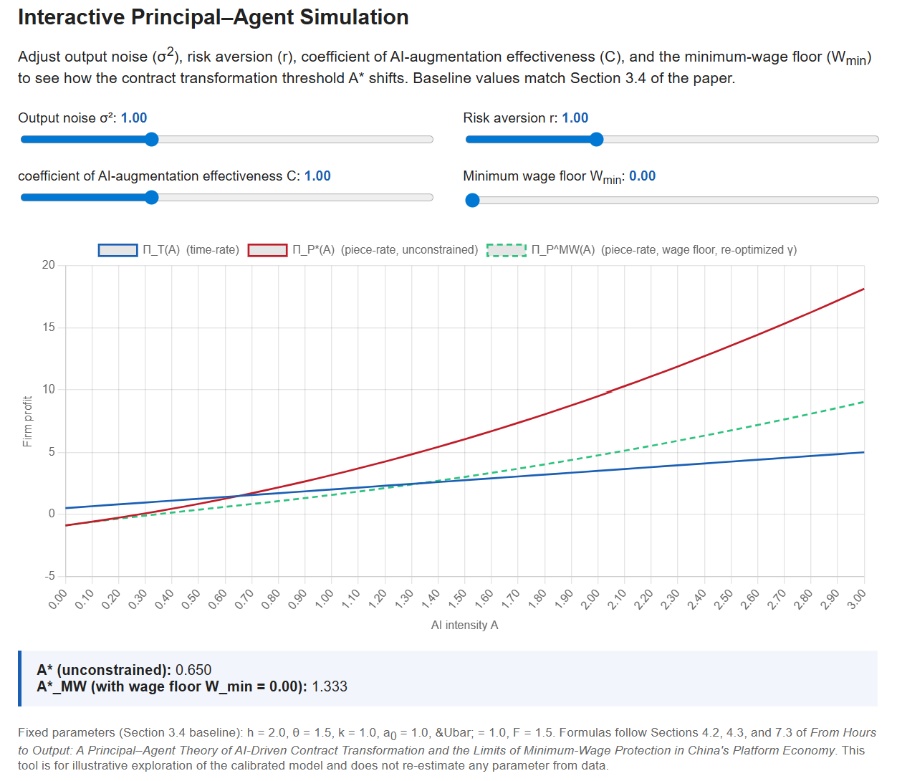
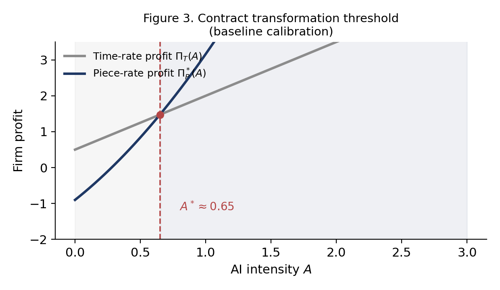
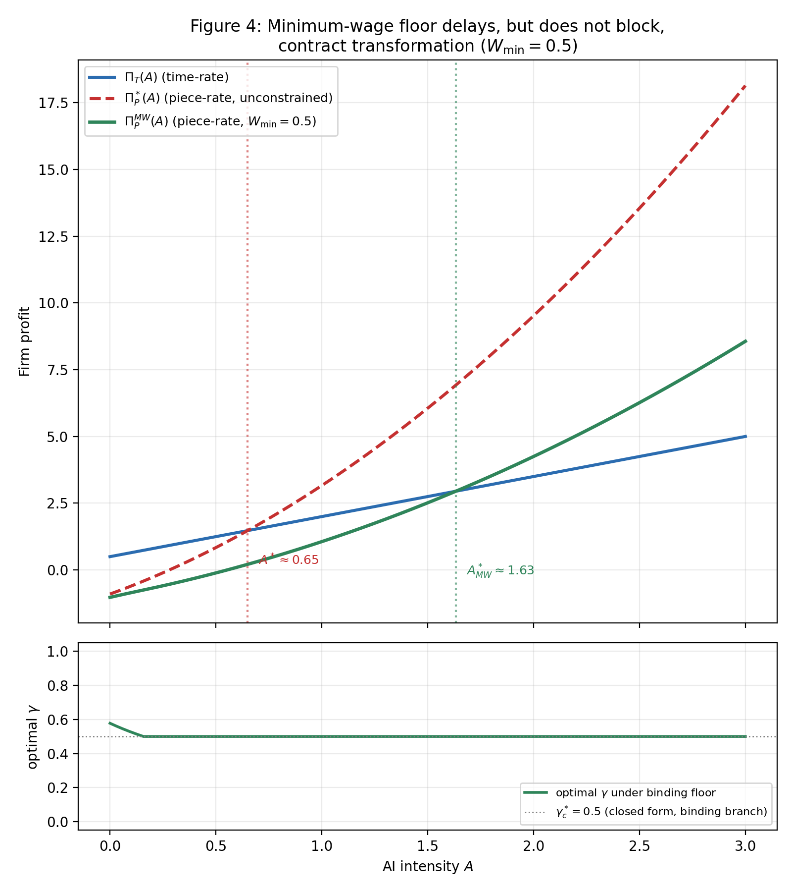

# From Hours to Output: A Principal–Agent Theory of AI-Driven Contract Transformation and the Limits of Minimum-Wage Protection in China's Platform Economy

Lucas Dang
RCF Experimental School, Beijing
July 2026

*Code and simulation scripts reproducing all figures and calibration results in this paper are publicly available at: https://github.com/danghaosheng2028/ai-contract-transformation. All derivations, including Appendices A.5–A.8, B, and C, are given in full below, so this document is self-contained. An interactive version of the core simulation — allowing readers to vary output noise $\sigma^2$, risk aversion $r$, the coefficient of AI-augmentation effectiveness $C$ (see Section 2.1 on why this paper avoids the term "complementarity" for $C$), and the minimum-wage floor $W_{\min}$ in real time — is available at https://danghaosheng2028.github.io/ai-contract-transformation/ (source: `docs/index.html` in the same repository).*

---

## Abstract

Why do some AI-augmented jobs shift to piece-rate pay while others stay on fixed wages — and why does China's minimum-wage system seem to slow, but not stop, that shift? This paper develops a principal–agent model in which AI augments a worker's effective human capital, $\tilde H = h+\theta AC$, and firms choose between a time-rate contract (fixed wage, enforced minimum effort) and a piece-rate contract (output-linked pay, digitally monitored, riskier for the worker).

We derive closed-form optimal contracts under each mode and prove there is a unique AI-intensity threshold $A^*$ above which firms switch from time-rate to piece-rate pay — because piece-rate profit grows convexly in AI intensity while time-rate profit only grows linearly. The threshold rises with output noise and worker risk aversion, falls with the coefficient of AI-augmentation effectiveness, and is provably unaffected by how the worker's outside option is specified or by any AI-driven automation gains common to both contract modes.

Numerically, a binding minimum wage roughly doubles to triples the AI intensity needed to trigger this switch, without blocking it outright; and the threshold is markedly lower for highly monitorable, AI-augmented occupations (e.g. platform delivery) than for occupations AI augments only weakly (e.g. manufacturing), a pattern broadly consistent with independent evidence on digitalization and wage growth in Chinese firms.

The model offers a unified account of why output-based pay is spreading unevenly across AI-exposed industries, with implications for labor regulation and AI-skills policy. We further situate the result against comparable gig-economy regulatory episodes in the United States, the United Kingdom, the European Union, and the newly adopted ILO Convention on platform work, and against the classical political-economy question of how AI's productivity gains are divided between firm and worker.

---

## Keywords

AI‑augmented production
principal–agent model
risk‑sharing
incentive design
contract transformation
piece‑rate compensation
time‑rate compensation
human–AI augmentation
minimum‑wage regulation
comparative statics

---

## Notation

| Symbol | Definition |
|---|---|
| $A$ | AI utilization intensity (firm/task-level), $A \in [0, \bar A]$ |
| $C$ | Coefficient of AI-augmentation effectiveness — task-specific marginal effectiveness of AI augmentation (see Section 2.1 for a note on this term's relation to "complementarity") |
| $\theta$ | AI amplification coefficient |
| $h$ | Baseline human capital |
| $\tilde H$ | Effective human capital, $\tilde H = h + \theta AC$ |
| $a$ | Worker effort |
| $a_0$ | Minimum enforceable effort under time-rate (Mode T) |
| $k$ | Effort-cost convexity parameter, $\psi(a) = \tfrac12 k a^2$ |
| $r$ | Worker absolute risk aversion (CARA) |
| $\sigma^2$ | Output noise variance, $\varepsilon \sim N(0,\sigma^2)$ |
| $\bar U$ | Reservation utility |
| $F$ | Fixed monitoring cost under piece-rate (Mode P) |
| $\alpha$ | Piece-rate base wage |
| $\gamma$ | Piece-rate incentive slope |
| $\gamma^*$ | Optimal piece-rate slope |
| $W_0$ | Fixed wage under time-rate |
| $\Pi_T(A)$ | Firm profit under time-rate contract |
| $\Pi_P^*(A)$ | Firm profit under optimal piece-rate contract |
| $A^*$ | Contract transformation threshold, $\Pi_T(A^*) = \Pi_P^*(A^*)$ |
| $W_{\min}$ | Minimum-wage floor |
| $G(A)$ | Profit difference, $G(A) = \Pi_P^*(A) - \Pi_T(A)$ |
| $g(A)$ | Effort-independent automation contribution to output (Appendix C) |

*Symbols are listed in order of first appearance in Sections 4.1–4.3.*

**A note on units.** All monetary quantities ($\Pi$, $W$, $\alpha$, $\bar U$) are expressed in standardized units — multiples of a representative monthly base-wage benchmark for the calibrated occupations, consistent with the reservation-utility normalization $\bar U = 1.0$ in Section 3.4. AI intensity $A$ is likewise a standardized index on $[0,3]$, constructed to span the empirical range of enterprise digital-tool penetration reported by CAICT (Section 3.1), rather than a directly observable physical quantity. This normalization follows standard practice in stylized principal–agent calibration exercises; numerical thresholds such as $A^*\approx0.65$ should not be read as directly comparable to indices constructed on different scales elsewhere (see the caveat in Section 3.5 regarding Chen and Guo, 2023).

---

## Contents（目录）

1. Introduction
2. Literature Review
   2.1 Principal–Agent Models of Incentives and Risk‑Sharing
   2.2 AI, Automation, and Labor Markets
   2.3 Platform Labor, Flexible Employment, and Chinese Labor Regulation
   2.4 Contribution Relative to the Literature
   2.5 A Political-Economy Lens: AI, Surplus Value, and the Restructuring of Production Relations
3. Stylized Facts and Parameter Calibration
   3.1 Stylized Fact 1: Rising AI Penetration in Chinese Firms
   3.2 Stylized Fact 2: Expansion of Flexible and Output‑Based Employment
   3.3 Stylized Fact 3: Empirical Estimates of Worker Risk Aversion
   3.4 Calibration of Remaining Parameters
   3.5 Suggestive Evidence for the Threshold Mechanism
   3.6 Widening the Lens: International Comparative Evidence
4. Model
   4.1 Environment
   4.2 Time‑Rate Contract (Mode T)
   4.3 Piece‑Rate Contract (Mode P)
   4.4 Timing
   4.5 Discussion
5. Equilibrium Analysis
   5.1 Time‑Rate Contract (Mode T)
   5.2 Piece‑Rate Contract (Mode P)
   5.3 Comparison of the Two Modes
6. Main Results
   6.1 Existence and Uniqueness of the Contract Transformation Threshold
   6.2 Comparative Statics of the Transformation Threshold
   6.3 Implications for Contract Design
7. Numerical Simulation
   7.1 Baseline Profit Comparison and the Transformation Threshold
   7.2 Comparative Statics: Threshold Surface $A^*(r,\sigma^2)$
   7.3 Regulatory Friction: Minimum Wage Constraint
   7.4 Summary of Simulation Results
   7.5 Sector Heterogeneity
   7.6 Joint Sensitivity of $A^*$ to $\theta$ and $k$
8. Conclusion and Policy Implications
   8.1 Policy Implications
   8.2 Limitations and Future Research
   8.3 Closing Reflection

Appendix A. Additional Proofs
   A.0 Second-Order Conditions (SOC)
   A.1 Global Convexity of $\Pi_P^*(A)$
   A.2 Existence and Uniqueness
   A.3 Derivative with Respect to Risk Aversion $r$
   A.4 Derivative with Respect to Augmentation Effectiveness $C$
   A.5 Corollary: Exact Closed-Form Dependence of $A^*$ on $\theta C$
   A.6 Corollary: Equal Elasticities for $r$ and $\sigma^2$
   A.7 Corollary: Invariance of $A^*$ to the Specification of Reservation Utility $\bar U$
   A.8 Numerical Check: Existence at the Interactive Widget's Parameter Extremes
Appendix B. A Unified Contract Family and Its Limits
   B.1 Extended Contract Space
   B.2 Proposition 1 (T/P as a Discrete Regime Choice)
   B.3 What This Buys, and an Honest Limitation
Appendix C. Robustness to an Effort-Independent Automation Channel
   C.1 Re-derivation
   C.2 Proposition 2 (Invariance of $A^*$ to Mode-Common Automation)
   C.3 Corollary: Full Automation Never Dominates Under This Specification
   C.4 What This Resolves, and What Remains Open
References

*This document is fully self-contained: Appendix A completes the proofs of Theorems 1 and 2 and derives four further structural corollaries (A.5–A.8); Appendices B and C give the full formal unification of the two contract modes and the robustness check against an unmodeled automation channel, respectively. No result in this paper depends on consulting any external source.*

---

# 1. Introduction

Picture two riders finishing an eight-hour shift on the same city street, a decade apart. The first, delivering for a fixed monthly wage, clocks in, follows a supervisor's rough sense of a fair day's work, and clocks out — how many parcels he carried barely enters the conversation. The second, delivering for Meituan or Ele.me today, glances at a countdown clock that an algorithm resets with every new order: finish faster and next week's order allocation improves; finish slower and it does not. Between these two riders lies exactly the transition this paper tries to explain — the shift from paying people for the *time* they show up to paying them for the *output* they produce. And this shift is not confined to China. A San Francisco Instacart shopper racing a delivery-time estimate, a London cyclist logging into the Deliveroo app, and a Jakarta driver watching Gojek's in-app incentive multiplier are, in their own regulatory settings, living through versions of the same reorganization of work — one that artificial intelligence, not just management fashion, is now accelerating almost everywhere at once.

This is not a small or narrowly technical shift. By 2023, more than 84 million workers in China were engaged in platform-based flexible employment — roughly one in six urban workers, most paid by the delivery, the ride, the livestreamed sale, or the completed task rather than by the hour. Since the 2021 *Guiding Opinions on Safeguarding the Labor Rights of New Employment Forms*, Chinese regulators have tried to keep pace with this shift. The clearest sign of how urgent the question has become worldwide came only weeks before this paper was finalized: on 12 June 2026, delegates from 187 countries meeting in Geneva at the 114th International Labour Conference voted 406 to 8, with 36 abstentions, to adopt ILO Convention No. 193 — the first binding international labor standard written specifically for the platform economy, covering an estimated 150 million-plus platform workers worldwide. Its central mechanism is not a wage rule at all: it requires platforms to disclose how their automated decision systems set pay and hours, and to provide human review of decisions that affect a worker's earnings — regulating the *algorithm*, not just the *paycheck*. Convention 193 did not appear from nowhere; it crystallizes a tension legal systems have been circling for years. The UK Supreme Court's 2021 ruling in *Uber BV v Aslam* found that Uber drivers were "workers" entitled to a minimum wage precisely because the platform's algorithm — not the driver — controlled how the job was done; California's Proposition 22 took the opposite tack, preserving platforms' algorithmic pricing flexibility while adding limited benefit floors; and the European Union's 2024 Platform Work Directive presumes an employment relationship wherever algorithmic management exercises enough control over a worker's day. Four different institutions, four different instruments, converging on the same underlying economic force from different directions.

That force carries a genuine benefit and a genuine cost, and the tension between them is the puzzle this paper sets out to formalize. On one hand, AI genuinely makes each hour of effort more valuable: smart routing gets a rider to more addresses per hour; a recommendation algorithm gets a livestream host in front of more buyers per broadcast. On the other hand, paying by output also means the worker now absorbs risk the firm used to absorb quietly through a flat wage — a rainstorm, a traffic jam, an algorithm glitch, an unlucky night's audience. Firms capture a share of AI's productivity dividend; workers gain in expectation but bear more of the day-to-day uncertainty in practice. This is the classical trade-off between *incentives* and *risk-sharing* that principal–agent theory has studied for half a century (Holmstrom, 1979) — but AI, by changing how productive a worker's effort is, changes exactly where that trade-off tips in the firm's favor of one contract over the other. Formalizing that tipping point is this paper's task, and it leads directly to the question this paper answers:

**Under what conditions should firms switch from time-rate to piece-rate compensation, and how does AI adoption shift this boundary?**

Existing research offers real foundations but does not yet answer this question directly. Classical principal–agent theory tells us, in the abstract, how firms should balance incentives against risk — but it was not built with an AI-augmented worker in mind. A newer literature on AI and labor markets (Acemoglu and Restrepo, 2018; Brynjolfsson, Li, and Raymond, 2025) carefully documents that AI raises productivity, but stops short of asking how that productivity gain should change the *shape of the pay contract itself*. And a handful of recent studies gesture at AI pushing firms toward output-based pay without deriving a closed-form threshold, its comparative statics, or its interaction with labor regulation.

This paper closes that specific gap by embedding AI into a tractable principal–agent model. We introduce an AI-augmented effective human capital function,

$$
\tilde{H} = h + \theta AC,
$$

derive closed-form expressions for optimal effort and incentives under each contract mode, and prove that a unique transformation threshold $A^*$ exists — the AI-intensity level at which a profit-maximizing firm switches from time-rate to piece-rate pay. Comparative statics show exactly how output noise, worker risk aversion, and the coefficient of AI-augmentation effectiveness shape this threshold. We then incorporate China's minimum-wage regulation and show that a binding wage floor substantially delays — roughly doubling to tripling the AI intensity required, though never categorically preventing — this contract transformation within the empirically relevant range.

In plain language, before the formal derivation, this is the whole mechanism behind that threshold. Both riders from this section's opening image work for firms with the same two basic pay options: a fixed wage that caps the firm's upside no matter how much AI-assisted routing raises a rider's output, or per-delivery pay that lets the firm capture that upside but requires building a digital monitoring system to verify it (the fixed cost $F$ in the model) and shifts the day-to-day noise of traffic, weather, and app glitches onto the rider. What tips a firm from the first option to the second is a simple asymmetry. Under the fixed wage, a productivity gain from better AI tools flows to the firm in a straight, one-for-one line — profit rises linearly with AI intensity $A$. Under per-delivery pay, because compensation is tied to output, the firm can also fine-tune the split between guaranteed pay and per-order pay as productivity rises, so profit does not just rise — it bends upward, growing *convexly* in $A$ rather than linearly. At low AI intensity that upward bend has not yet cleared the fixed cost of monitoring, so the flat wage still wins; past the threshold $A^*$ this paper derives, the curve has crossed the line, and per-delivery pay becomes the more profitable choice for the firm. That crossing point is the single number this paper is built around, and three natural follow-up questions organize the rest of it: *when does the crossing happen sooner or later* — Section 6 derives exact formulas showing it depends on how much income risk bothers the worker, how noisy their output is, and how effective the AI tools genuinely are; *does a minimum wage stop it* — Section 7 shows it does not, but substantially delays it, by raising the cost of the base pay a piece-rate contract must still guarantee; and *does the pattern actually show up in practice* — Sections 3, 3.6, and 7 argue that it broadly does, with highly AI-augmented, easily monitored occupations like platform delivery already shifted heavily toward output-based pay, while occupations AI helps only weakly, such as manufacturing, mostly have not.

Beyond the formal model, we also situate the result within two broader conversations this kind of threshold naturally invites. Section 2.5 asks what the shift from time-rate to piece-rate pay looks like through the lens of classical political economy — specifically Marx's labor theory of value — and what, if anything, that older framework still has to say about a firm's decision to let an algorithm price a worker's output. Section 3.6 widens the empirical lens beyond China to ask whether the same threshold logic is visible in how gig-economy regulation has actually evolved in the United States, the United Kingdom, the European Union, and — most recently and most authoritatively — the new ILO Convention. Section 8 then closes not just with the model's formal policy implications but with a concrete, numbered set of recommendations informed by both.

The remainder of the paper proceeds as follows. Section 2 reviews the related literature and, in Section 2.5, offers a political-economy reading of the mechanism. Section 3 presents stylized facts and parameter calibration for China, together with an international comparative section (3.6) and suggestive evidence from independent Chinese firm-panel data. Section 4 introduces the model. Section 5 derives equilibrium outcomes. Section 6 presents the main theoretical results. Section 7 provides numerical simulations, including sensitivity and sector-heterogeneity analysis. Section 8 concludes with a numbered set of policy recommendations and a closing reflection. Appendix A completes the proofs of Theorems 1 and 2 and derives four further structural corollaries; Appendices B and C give a full formal unification of the two contract modes and a robustness check against an unmodeled automation channel, respectively. All three appendices are complete and self-contained in this document. Readers primarily interested in the argument rather than the algebra can read the plain-language summary above, Section 2.5, Section 3.6, and Section 8 largely on their own; the intervening sections supply the formal proof that the intuition is correct.

---

# 2. Literature Review

## 2.1 Principal–Agent Models of Incentives and Risk‑Sharing

The theoretical foundation of this paper lies in the canonical principal–agent framework. Holmstrom (1979) establishes that under CARA utility and normally distributed noise, optimal contracts are linear in output and balance incentives against risk exposure. Holmstrom and Milgrom (1991) extend this insight to multi‑task environments, showing that high‑noise tasks favor fixed wages because incentives distort effort allocation.

Subsequent work has refined these insights. Lazear (2000) documents empirically how piece‑rate compensation increases productivity but also raises income volatility. Prendergast (2002) emphasizes the role of uncertainty in shaping incentive strength. These studies highlight the tradeoff between incentives and risk, but they do not incorporate AI as a productivity‑augmenting force nor analyze how AI shifts the optimal contract boundary.

This paper contributes to this literature by embedding AI‑augmented production into the Holmstrom–Milgrom framework. By modeling effective human capital as $\tilde{H}=h+\theta AC$, we show that AI amplifies the incentive effect of piece‑rate contracts and generates a unique transformation threshold $A^*$ at which firms optimally switch from time‑rate to piece‑rate compensation.

**On the functional form and terminology.** We adopt the additive-linear form $\tilde H = h+\theta AC$, rather than a multiplicative or CES alternative (as in Acemoglu and Restrepo, 2018), because it keeps $\Pi_T(A)$ exactly linear in $A$ — the linear-versus-convex asymmetry that drives Theorem 1 — and gives $\theta C$ a direct reading as the marginal human-capital return to AI intensity. We call $C$ the "coefficient of AI-augmentation effectiveness" throughout, rather than "complementarity": the additive form technically implies infinite substitutability between $h$ and AI-augmented capacity, closer to substitution than to the low-elasticity sense the word "complementarity" usually carries in production theory. "Coefficient" is a deliberately generic label — it makes no claim about complementarity, substitutability, or any other production-theory relationship, only that $C$ scales AI's task-specific marginal effectiveness — and it has the incidental advantage of giving the symbol $C$ a natural reading. We flag, without resolving, two related scope boundaries: whether the existence-and-uniqueness result of Theorem 1 extends to other augmentation functions increasing and unbounded in $A$ (we conjecture it does, but only the additive-linear form delivers Appendix A's exact elasticities), and $C$'s treatment as exogenous and time-invariant (Section 8.2).

## 2.2 AI, Automation, and Labor Markets

A second strand of literature examines how AI and automation reshape labor markets. Acemoglu and Restrepo (2018) develop a task‑based model in which automation reallocates labor across tasks and affects wages and employment. Brynjolfsson, Li, and Raymond (2025) provide empirical evidence that generative AI tools significantly increase individual productivity in a knowledge-intensive customer-support setting. Other studies document how AI affects monitoring, prediction, and managerial decision‑making.

However, this literature focuses primarily on employment, productivity, and task allocation—not on compensation design. A concurrent working paper by Shin and Kang (2026) develops a forecasting framework for a parallel shift from time-based to output-based *talent accounting* in the human-AI era, centred on a closed-form threshold result (their Theorem 3, "ROI Inversion at τ*") and using Korea's staged 52-hour workweek mandate as an empirical early-warning case for rising overhead pressure. Their framework operates at the level of firm-wide talent accounting and overhead allocation rather than the individual contract-design problem this paper studies, and does not model risk-sharing between a risk-neutral firm and a risk-averse worker under moral hazard. No existing model — including theirs — formally links AI adoption to the optimal allocation of risk and incentives within an individual employment contract, which remains this paper's specific contribution.

## 2.3 Platform Labor, Flexible Employment, and Chinese Labor Regulation

A third strand of literature examines the rise of platform labor and flexible employment in China. Government reports indicate that platform‑based flexible workers exceeded 84 million in 2023, reflecting rapid growth in gig‑economy sectors such as logistics, ride‑hailing, and digital content creation. Scholars have analyzed how platform algorithms shape labor supply, monitoring, and compensation, and how regulatory frameworks attempt to balance flexibility with worker protection.

A central regulatory instrument is the minimum‑wage system, which imposes binding constraints on base wages even in flexible employment arrangements. Recent policy documents emphasize the need to protect workers from excessive income volatility, but they do not analyze how such regulations interact with incentive design or AI adoption.

## 2.4 Contribution Relative to the Literature

Relative to these three strands, the paper makes four contributions:

1. **A closed‑form transformation threshold.**
   We derive a unique $A^*$ at which firms optimally switch from time‑rate to piece‑rate compensation, and an exact closed-form expression $A^* = x^*/(\theta C)$ for how this threshold depends on the AI amplification coefficient and augmentation effectiveness (Appendix A.5).

2. **Comparative statics linking risk, uncertainty, and AI augmentation effectiveness.**
   Using the implicit function theorem, we show how noise, risk aversion, and the coefficient of AI-augmentation effectiveness jointly determine the transformation threshold, derive exact elasticity results (Appendix A.5–A.6), and prove the threshold's invariance to both the specification of worker reservation utility (Appendix A.7) and to any effort-independent automation channel common to both contract modes (Appendix C).

3. **Integration of Chinese labor regulation.**
   By incorporating minimum‑wage constraints, we show that regulatory frictions substantially delay — but do not categorically block — contract transformation in China's rapidly digitalizing labor markets (Section 7.3).

4. **Sector heterogeneity linked to independent empirical evidence, with open, reproducible code.**
   We show that $A^*$ differs systematically across occupations with different monitorability and coefficients of AI-augmentation effectiveness (Section 7.5), and we relate this ordering to independent Chinese firm-panel evidence on digitalization and wage growth (Section 3.5). All calibration and simulation code is publicly released for reproducibility.

## 2.5 A Political-Economy Lens: AI, Surplus Value, and the Restructuring of Production Relations

The three literatures above analyze the shift from time-rate to piece-rate pay as a *contracting* problem — the firm and the worker jointly choosing the pay structure that best allocates risk and incentive given AI's productivity gain. That framing is standard, and it is the one this paper's formal model adopts throughout. But it is worth pausing, before turning to the data and the model, to ask what an older and quite different tradition in economics would make of the same transition — not to replace the contracting view, but to place it in a wider light, since the two lenses turn out to disagree about something the model itself cannot settle: what the firm's rising share of AI's productivity gain, in Section 6's Theorem 1, actually *represents*.

**The classical question.** Marx's labor theory of value distinguishes a worker's *necessary labor* — the portion of a working day that reproduces the value of the worker's own subsistence — from *surplus labor*, whose value the employer retains as profit. Marx further distinguishes two ways an employer can enlarge that surplus: extracting *absolute* surplus value by lengthening the working day itself, and extracting *relative* surplus value by raising labor's productivity — through machinery, division of labor, or, in this paper's setting, AI-augmented tools — so that the same working day now produces more value than before, without the worker's compensation rising proportionally. Read through this lens, the model's central object, $\tilde H = h+\theta AC$, is a formal statement of exactly the second mechanism: AI raises what a given hour of a worker's labor is worth to the firm ($\theta AC$), and Theorem 1 shows that above the threshold $A^*$, the firm's *optimal* response is not to pass that entire gain through to the worker's guaranteed pay, but to redesign the contract itself — shifting from a flat wage to a piece rate — so that a larger share of AI's productivity dividend accrues to profit rather than to the worker's certain income. This is not merely a historical analogy transplanted onto a modern setting: a small but growing recent literature has proposed the term "algorithmic surplus value" to describe exactly this mechanism, treating it not as a break from Marx's framework but as a digital-era intensification of relative surplus value, in which AI systems compress the labor time socially necessary to produce a given output without themselves being an independent source of value (Zhang, 2026). In this reading, the fixed monitoring cost $F$ in Section 4.3 is not a neutral technological parameter; it is the price of building the digital *labor-process control* — the countdown clocks, GPS pings, and rating algorithms of Harry Braverman's (1974) "labor and monopoly capital" thesis, updated for the smartphone era — that lets the firm convert a productivity gain it could not otherwise verify into a wage bill it can precisely calibrate. Veena Dubal's (2023) legal analysis of what she terms "algorithmic wage discrimination" documents the same mechanism from a law-and-economics angle: once a platform can price labor by the transaction rather than the hour, the wage itself becomes a real-time, individualized, and largely unappealable output of the firm's algorithm — precisely the concentration of measurement power this paper's $F$ represents formally. The 2020 Chinese investigative report "外卖骑手，困在系统里" ("Delivery Riders, Trapped in the System," *人物* magazine, September 2020), which documented how platform algorithms compressed delivery-time estimates faster than riders could safely keep pace, is frequently cited in Chinese public debate as a vivid illustration of exactly this dynamic: an algorithm setting the terms of intensified effort that a rider individually cannot renegotiate.

**The contracting counter-reading.** The mainstream principal–agent view this paper's model formalizes offers a materially different account of the same facts, and it deserves equal weight rather than a supporting-actor role. On this view, the piece-rate contract is not primarily an instrument of extraction but a solution to a genuine information problem: effort is unobservable (Section 4.1's moral-hazard assumption), so the firm cannot simply pay for effort directly, and a competitive labor market (the participation constraint of Section 4.1) requires the contract to deliver at least the worker's outside option $\bar U$ regardless of contract mode. Under this reading, the firm's larger profit share above $A^*$ reflects the fixed cost $F$ and the risk premium the firm must still pay a risk-averse worker for bearing output noise (Section 5.2) — a return to the party bearing verifiable cost and risk, not an unearned appropriation. Both readings agree on the *facts* the model derives — that piece-rate pay concentrates income risk on the worker while letting the firm capture a convexly growing share of AI's output gain (Theorem 1) — and disagree only on how to interpret that allocation normatively: as an efficient response to an information and risk-sharing problem, or as a historically specific instance of capital appropriating labor's productivity gains through control over the technology of measurement itself.

**Why this matters for reading the rest of the paper.** This paper does not adjudicate between these two readings, and nothing in Sections 4–7's formal results depends on which one a reader prefers — Theorem 1's threshold $A^*$ is the same number either way. What differs is only how one *evaluates* crossing it. We flag the distinction here for three reasons. First, it explains why the same empirical fact — China's platform-labor sector moving rapidly toward piece-rate pay (Section 3.2) — is described in Chinese and international commentary alternately as an efficiency success story and as a cautionary tale about algorithmic control, without either camp necessarily disputing the underlying numbers. Second, it foreshadows a point this paper's own limitations analysis reaches independently in Section 8.2(11): if platforms hold *monopsony* power over workers with limited outside options — rather than facing the fully competitive labor market the participation constraint $CE=\bar U$ assumes — then the efficient-contracting reading weakens on its own terms, and the model's results would then also be consistent with a partial appropriation of surplus beyond what competitive risk-sharing requires. Third, and most directly, it is why Section 8's policy recommendations do not rest on efficiency grounds alone: a regulator who finds the surplus-value reading at least partially persuasive has an additional reason, beyond the pure risk-protection logic of Section 6.2, to support the algorithmic-transparency and bargaining-power measures proposed in Section 8.1(5) — measures that make sense on the contracting view too, but for a narrower reason.

# 3. Stylized Facts and Parameter Calibration

This section presents three stylized facts that motivate the model and guide the calibration of key parameters. The goal is to anchor the theoretical framework in empirical patterns observed in China's rapidly digitalizing labor markets and to justify the numerical values used in the simulations in Section 7. The facts correspond directly to the model's core parameters: AI intensity $A$, augmentation effectiveness $C$, output noise $\sigma^2$, and worker risk aversion $r$.

---

## 3.1 Stylized Fact 1: Rising AI Penetration in Chinese Firms

China has experienced a rapid increase in enterprise‑level digitalization and AI adoption. The China Academy of Information and Communications Technology (CAICT) has documented substantial and sustained growth in enterprise digitalization over the 2018–2022 period, with industries such as logistics, e‑commerce operations, content creation, and customer service adopting AI‑based workflow tools, automated monitoring systems, and algorithmic decision‑making at scale.

This motivates modeling AI intensity $A$ as a continuous variable capturing the degree of AI integration into production. The simulation range $A \in [0,3]$ corresponds to the empirical transition from low to high AI penetration.

---

## 3.2 Stylized Fact 2: Expansion of Flexible and Output‑Based Employment

China's platform economy has expanded dramatically. Government statistics indicate that platform‑based flexible workers exceeded 84 million in 2023, a substantial increase from 2019. These workers include couriers, ride‑hailing drivers, livestream hosts, and digital content creators—occupations where output‑based compensation is increasingly prevalent.

This fact supports the model's focus on contract transformation from time‑rate to piece‑rate pay. It also motivates the inclusion of a fixed monitoring cost $F$, reflecting the digital infrastructure required to implement output‑based compensation.

---

## 3.3 Stylized Fact 3: Empirical Estimates of Worker Risk Aversion

Labor economics provides empirical guidance on the magnitude of worker risk aversion. Chetty (2006) and subsequent studies estimate absolute risk aversion parameters in the range $r \in [0.2,2.0]$ for typical workers facing income volatility. This range is consistent with observed behavior in gig‑economy occupations.

We therefore set $r = 1.0$ as the baseline value and explore the full empirical range in comparative statics.

---

## 3.4 Calibration of Remaining Parameters

To ensure internal consistency and empirical plausibility, the remaining parameters are calibrated as follows:

- Baseline human capital: $h = 2.0$
- AI amplification coefficient: $\theta = 1.5$
- Coefficient of AI-augmentation effectiveness: $C = 1.0$
- Effort cost parameter: $k = 1.0$
- Minimum enforceable effort: $a_0 = 1.0$
- Reservation utility: $\bar{U} = 1.0$
- Output noise: $\sigma^2 = 1.0$
- Monitoring cost: $F = 1.5$

These values jointly produce a baseline transformation threshold:

$$
A^* \approx 0.65
$$

which aligns with mid‑range AI penetration levels in Chinese digital service industries. (See the units note following the Notation table for how these standardized values map to the empirical ranges of Sections 3.1–3.3.)

---

## 3.5 Suggestive Evidence for the Threshold Mechanism

While this paper does not conduct firm-level regression, existing Chinese panel-data evidence is consistent with the threshold logic of Theorem 1. Using a text-based digitalization index for 2,846 Chinese A-share firms (2010–2020), Chen and Guo (2023) find that the relationship between digital transformation and average wages is non-monotonic: below a digitalization threshold of 2.773, labor-substitution effects dominate and wage growth is suppressed, but above this threshold, productivity and market-competition effects dominate and wages rise significantly — an effect strongest in labor-intensive and knowledge-intensive industries. This empirical wage-side threshold is the mirror image of the profit-side threshold $A^*$ derived in Section 6: both point to AI/digital intensity producing a discontinuous rather than gradual shift in how firms compensate labor. On the institutional side, ILO survey evidence confirms that location-based platform work in China (delivery, ride-hailing) is already overwhelmingly compensated by piece rate rather than time rate (Chen, 2021), consistent with this paper's premise that AI-intensive, easily-monitored tasks are where the transformation predicted by Theorem 1 is empirically observed first.

**A caveat on comparability.** The numerical threshold reported by Chen and Guo (2023) — a digitalization index value of 2.773 — and this paper's $A^*\approx0.65$ are constructed on entirely different scales (a firm-level text-based digitalization index versus this paper's standardized AI-intensity parameter) and are not directly comparable in magnitude. The parallel drawn here is qualitative only: both studies point to a discontinuous, threshold-crossing pattern in how digital/AI intensity relates to labor compensation, not a claim that the two threshold values coincide or should be benchmarked against one another. We also note that Chen and Guo's panel-fixed-effects design addresses some, but not all, endogeneity concerns — firms with faster wage growth may also invest more in digitalization, a reverse-causality channel this paper does not independently resolve and treats their finding as suggestive corroboration rather than causal validation of this paper's specific mechanism.

## 3.6 Widening the Lens: International Comparative Evidence

The stylized facts above are drawn entirely from China, both because China's regulatory response (the 2021 *Guiding Opinions*) gives the model's minimum-wage extension (Section 7.3) a concrete institutional anchor, and because the underlying data — CAICT's digitalization statistics, the 84-million-worker platform-employment figure, Chen and Guo's (2023) firm panel — happen to be Chinese. But the economic force the model formalizes is not China-specific, and four episodes of gig-economy regulation abroad, chosen because each turns on essentially the same question this paper's threshold $A^*$ answers — *how much does algorithmic monitoring of output change the economics of the employment relationship* — corroborate that the pattern generalizes.

**The United States: worker classification as a proxy fight over the same threshold.** California's Proposition 22 (2020) and the subsequent litigation over its constitutionality did not, on its face, concern AI or compensation design; it concerned whether app-based drivers were "employees" or "independent contractors." But the underlying economic dispute was precisely this paper's mechanism in another guise: once a platform's algorithm can price, monitor, and route every trip in real time, the traditional case for time-rate protections — that effort is otherwise unverifiable, so firms must supervise and pay a fixed wage instead — weakens exactly as $A$ rises past $A^*$ in the model of Section 6. Prop 22 effectively let ride-hailing platforms retain piece-rate-style flexibility while adding limited, output-independent benefit floors, an outcome that sits closer to the hybrid base-plus-commission structure this paper's Appendix B shows the *baseline* model cannot rationalize without extension — a live illustration of exactly the gap Appendix B.3 identifies.

**The United Kingdom: a court reaching the same conclusion from the opposite direction.** The 2021 UK Supreme Court ruling in *Uber BV v Aslam* found that Uber drivers were "workers" entitled to minimum-wage and holiday-pay protections, and grounded that finding specifically in the degree of algorithmic control Uber exercised — the driver's inability to negotiate fares, routes, or ratings, all effectively set by the platform's dispatch system. Where Prop 22 largely preserved firms' flexibility to price labor algorithmically, the UK courts instead concluded that a sufficiently AI-monitored, algorithmically dispatched job crosses into an employment relationship deserving of protection regardless of contract label — the same underlying observation (heavy algorithmic monitoring changes what kind of job this is) read toward the opposite regulatory conclusion. The contrast is instructive on its own: two advanced economies, looking at structurally similar platforms, drew opposite institutional conclusions from the same rise in $A$.

**The European Union: regulating the threshold mechanism directly.** The EU's Platform Work Directive (Directive (EU) 2024/2831), adopted in October 2024 and entering into force that December, goes further than either the US or UK approach by regulating the *algorithmic management* mechanism itself rather than only the resulting pay structure: it creates a rebuttable legal presumption of employment wherever a platform exercises sufficient algorithmic control, and it separately mandates transparency and human review of automated decisions affecting a worker's pay, hours, or account status. In this paper's terms, the Directive is a regulatory intervention aimed not at $A^*$ directly (as China's minimum wage is modeled doing in Section 7.3) but at the *monitoring cost* $F$ and the *contract space* itself (Appendix B) — raising the compliance cost of running a purely piece-rate system and constraining how the incentive slope $\gamma$ can be set, which this paper's comparative statics (Theorem 2) predict would raise $A^*$ in the same direction as, though through a different channel than, China's minimum wage.

**The International Labour Organization: regulating the mechanism, globally, and only weeks before this paper's finalization.** The clearest confirmation that the EU's approach reflects a broader convergence, not a regional idiosyncrasy, is ILO Convention No. 193, adopted 12 June 2026 at the 114th International Labour Conference by a vote of 406 to 8, with 36 abstentions — the first binding international labor standard devoted specifically to platform work, and the first to address algorithmic management directly in a treaty text. Like the EU Directive, its central obligations target disclosure of automated decision-making and human review of decisions affecting pay and hours, rather than a wage floor as such; unlike the EU Directive, it does so at global scale, applying in principle to any of the estimated 150 million-plus platform workers worldwide once a member state ratifies it. In this paper's terms, Convention 193 is a second, independent, and far more authoritative data point for the same claim Section 3.6 draws from the EU alone: that the policy lever this paper's own model identifies as structurally important — raising the monitoring cost $F$ and constraining the incentive slope $\gamma$, rather than only the base wage $\alpha$ — is not a single jurisdiction's regulatory preference but the direction international labor governance has now moved as a matter of binding law.

**What the comparison adds.** None of these four episodes is a test of this paper's specific numerical calibration — the goal here is not to claim $A^*\approx0.65$ generalizes internationally, but to show that the qualitative logic does: wherever AI-enabled monitoring has made output cheap to verify, legal and regulatory systems worldwide have had to grapple with the same underlying question this paper poses formally, and have reached visibly different answers — from Prop 22's flexibility-preserving compromise to Convention 193's global disclosure mandate — depending on how each system weighs the efficiency gains of Section 6.2 against the risk-shifting costs also derived there. This cross-national variation is itself useful evidence: it suggests the "efficiency versus equity" tradeoff formalized in Section 8.1(4) is not an artifact of this paper's Chinese calibration, but a structural feature of the underlying economics that different institutional traditions — now including a near-unanimous vote of the international community itself — have converged on addressing through the same channel this paper's own comparative statics identify as most effective. We return to this point directly in Section 8.1(5).

# 4. Model

This section presents the formal environment of the model. We consider a one‑period principal–agent framework in which a risk‑neutral firm hires a single worker whose effort is not contractible. The firm chooses between two compensation modes—time‑rate and piece‑rate—and AI technology enters the production process by augmenting the worker's effective human capital.

---

## 4.1 Environment

### Effective human capital

AI augments human capital according to:

$$
\tilde{H} = h + \theta AC
$$

where:

- $h > 0$ is baseline human capital
- $A \ge 0$ is AI utilization intensity
- $C > 0$ is the coefficient of AI-augmentation effectiveness (see Section 2.1's note on terminology)
- $\theta > 0$ is the amplification effect of AI

---

### Production technology

Output is:

$$
y = a\tilde{H} + \varepsilon
$$

where $\varepsilon \sim N(0,\sigma^2)$. Appendix C considers an extension in which output also includes an effort-independent automation term $g(A)$, and shows the paper's main results are unaffected whenever this term is common to both contract modes.

---

### Effort cost

Effort incurs convex cost:

$$
\psi(a) = \frac{1}{2}ka^2
$$

---

### Worker preferences

The worker has CARA utility with absolute risk aversion $r > 0$.
Certainty equivalent:

$$
CE = E[w] - \frac{1}{2}r\,\mathrm{Var}(w) - \psi(a)
$$

---

### Moral hazard

Effort $a$ is not observable or contractible.

---

### Participation constraint

Competitive labor markets imply:

$$
CE = \bar{U}
$$

Appendix A.7 shows the model's central threshold result does not depend on $\bar U$ being constant across $A$; it holds for any specification $\bar U(A)$.

---

## 4.2 Time‑Rate Contract (Mode T)

Under time‑rate compensation:

- Worker receives fixed wage $W_0$
- Firm enforces minimum effort $a_0$

Participation constraint:

$$
W_0 - \frac{1}{2}ka_0^2 = \bar{U}
$$

Thus:

$$
W_0 = \bar{U} + \frac{1}{2}ka_0^2
$$

Firm profit:

$$
\Pi_T(A)
= a_0(h+\theta AC) - \bar{U} - \frac{1}{2}ka_0^2
$$

This is **linear** in AI intensity $A$:

$$
\frac{d\Pi_T}{dA} = a_0\theta C
$$

---

## 4.3 Piece‑Rate Contract (Mode P)

Compensation:

$$
w = \alpha + \gamma y
$$

---

### Worker's effort choice

Worker solves:

$$
\max_a\; \gamma a\tilde{H} - \frac{1}{2}ka^2
$$

Thus:

$$
a^* = \frac{\gamma\tilde{H}}{k}
$$

---

### Participation constraint

Certainty equivalent:

$$
CE = \alpha
+ \gamma a^*\tilde{H}
- \frac{1}{2}r\gamma^2\sigma^2
- \frac{1}{2}k(a^*)^2
$$

Substitute $a^*$:

$$
CE = \alpha
+ \frac{1}{2k}\gamma^2\tilde{H}^2
- \frac{1}{2}r\gamma^2\sigma^2
$$

Set $CE = \bar{U}$:

$$
\alpha
= \bar{U}
+ \frac{1}{2}r\gamma^2\sigma^2
- \frac{1}{2k}\gamma^2\tilde{H}^2
$$

---

### Firm profit

Expected profit:

$$
\Pi_P(\gamma)
= (1-\gamma)a^*\tilde{H} - \alpha - F
$$

Substitute $a^*$ and $\alpha$:

$$
\Pi_P(\gamma)
= \frac{\gamma\tilde{H}^2}{k}
- \frac{1}{2k}\gamma^2\tilde{H}^2
- \frac{1}{2}r\gamma^2\sigma^2
- \bar{U} - F
$$

---

### Optimal piece‑rate

FOC yields:

$$
\gamma^*
= \frac{\tilde{H}^2}{\tilde{H}^2 + rk\sigma^2}
$$

Optimal profit:

$$
\Pi_P^*(A)
= \frac{\tilde{H}^4}{2k(\tilde{H}^2 + rk\sigma^2)}
- \bar{U} - F
$$

---

## 4.4 Timing

1. Firm chooses contract mode.
2. Under piece‑rate, firm chooses $(\alpha,\gamma)$.
3. Worker chooses effort $a$.
4. Output realized; wage paid.

**Figure 1: Model timing.** The four-stage sequence of the one-period principal–agent game: the firm's contract-mode choice (Section 6's $A^*$ threshold) is made before the piece-rate parameters, which are set before the worker's effort choice, which is made before output and payment are realized. *(See `simulation/fig1_timing.png` in the code repository.)*

---

## 4.5 Discussion

The model embeds AI into the Holmstrom–Milgrom linear contracting framework by allowing AI intensity $A$ and augmentation effectiveness $C$ to scale effective human capital. AI amplifies both productivity and the returns to effort, altering the firm's optimal risk‑sharing arrangement and potentially triggering contract transformation.

A natural question is whether Mode T and Mode P can be viewed as two points on a single contract family, with $\gamma=0$ recovering Mode T exactly. A naive reading does not work: setting $\gamma=0$ in the worker's first-order condition $a^*=\gamma\tilde H/k$ gives zero effort, not the enforced effort $a_0>0$ that defines Mode T. The two modes rely on structurally different enforcement technologies — attendance-based supervision versus output-contingent digital monitoring — and cannot be unified by varying $\gamma$ alone. Appendix B formalizes a genuine unification by introducing a second contract instrument (an enforced effort floor implemented through attendance supervision) and shows that the firm's optimum in this extended space is always a corner — either pure time-rate or pure piece-rate, never a blend of the two mechanisms. We flag there, and note here for visibility, that this corner-solution prediction sits in tension with commonly observed hybrid compensation schemes (base pay plus commission) in China's platform economy, and we discuss the specific cost-structure assumption responsible for that prediction, along with the extension that would relax it.

# 5. Equilibrium Analysis

This section derives the equilibrium outcomes under the two compensation modes introduced in Section 4. We first characterize the firm's profit under the time‑rate contract, which is linear in AI intensity. We then solve the worker's incentive problem under the piece‑rate contract, derive the optimal piece‑rate parameter, and obtain the firm's optimal profit. The comparison of these two profit functions forms the basis for the contract transformation threshold analyzed in Section 6.

---

## 5.1 Time‑Rate Contract (Mode T)

Under the time‑rate contract, the firm enforces a minimum effort level $a_0$ through attendance monitoring. The worker receives a fixed wage $W_0$, and her certainty equivalent is:

$$
CE_T = W_0 - \frac{1}{2}ka_0^2
$$

The participation constraint $CE_T = \bar{U}$ implies:

$$
W_0 = \bar{U} + \frac{1}{2}ka_0^2
$$

The firm's expected profit is therefore:

$$
\Pi_T(A)
= a_0(h+\theta AC) - \bar{U} - \frac{1}{2}ka_0^2
$$

This profit is **linear** in AI intensity $A$:

$$
\frac{d\Pi_T}{dA} = a_0\theta C
$$

---

## 5.2 Piece‑Rate Contract (Mode P)

Under the piece‑rate contract:

$$
w = \alpha + \gamma y
$$

The firm chooses $(\alpha,\gamma)$ to satisfy incentive compatibility (IC) and individual rationality (IR), and to maximize expected profit.

---

### Step 1: Incentive Compatibility (IC)

Worker chooses effort $a$ to maximize:

$$
CE_P(a)
= \alpha + \gamma a\tilde{H}
- \frac{1}{2}r\gamma^2\sigma^2
- \frac{1}{2}ka^2
$$

FOC yields:

$$
a^* = \frac{\gamma\tilde{H}}{k}
$$

The second-order condition is $\partial^2 CE_P/\partial a^2 = -k < 0$ for all $k>0$, confirming $a^*$ is a strict global maximum (see also Appendix A.0).

---

### Step 2: Participation Constraint (IR)

Substitute $a^*$:

$$
CE_P
= \alpha
+ \frac{1}{2k}\gamma^2\tilde{H}^2
- \frac{1}{2}r\gamma^2\sigma^2
$$

Set $CE_P = \bar{U}$:

$$
\alpha
= \bar{U}
+ \frac{1}{2}r\gamma^2\sigma^2
- \frac{1}{2k}\gamma^2\tilde{H}^2
$$

---

### Step 3: Firm Profit Maximization

Expected profit:

$$
\Pi_P(\gamma)
= (1-\gamma)a^*\tilde{H} - \alpha - F
$$

Substitute $a^*$ and $\alpha$:

$$
\Pi_P(\gamma)
= \frac{\gamma\tilde{H}^2}{k}
- \frac{1}{2k}\gamma^2\tilde{H}^2
- \frac{1}{2}r\gamma^2\sigma^2
- \bar{U} - F
$$

FOC yields optimal piece‑rate:

$$
\gamma^*
= \frac{\tilde{H}^2}{\tilde{H}^2 + rk\sigma^2}
$$

The second-order condition $\partial^2\Pi_P/\partial\gamma^2 = -\tilde H^2/k - r\sigma^2 < 0$ holds for all $\tilde H, k, r, \sigma^2 > 0$, confirming $\Pi_P(\gamma)$ is strictly concave and $\gamma^*$ is the unique global maximizer, so $\gamma^*\in(0,1)$ (Appendix A.0).

Optimal profit:

$$
\Pi_P^*(A)
= \frac{\tilde{H}^4}{2k(\tilde{H}^2 + rk\sigma^2)}
- \bar{U} - F
$$

---

## 5.3 Comparison of the Two Modes

Define profit difference:

$$
G(A) = \Pi_P^*(A) - \Pi_T(A)
$$

Section 6 shows:

- $G(0) < 0$ due to fixed cost $F$
- $G(A) \to +\infty$ as $A \to \infty$
- $G(A)$ is strictly convex on the entire domain (Appendix A.1), not merely for large $A$

Thus a unique threshold $A^*$ exists.

# 6. Main Results

This section presents the core theoretical results of the paper. We show that AI‑augmented production generates a unique threshold in AI utilization intensity at which firms optimally switch from time‑rate to piece‑rate compensation. We then characterize how this threshold responds to changes in output noise, worker risk aversion, and the coefficient of AI-augmentation effectiveness.

---

## 6.1 Existence and Uniqueness of the Contract Transformation Threshold

Define:

$$
G(A) = \Pi_P^*(A) - \Pi_T(A)
$$

---

### **Theorem 1 (Existence and uniqueness of $A^*$).**

*Domain and regularity.* $A$ ranges over $[0, \bar{A}]$ for some arbitrarily large $\bar{A}$; $k>0$ ensures the effort-cost function $\psi(a)=\tfrac{1}{2}ka^2$ is strictly convex, which is what guarantees a well-defined interior optimum $a^*$ in Sections 4.3 and 5.2. Given these regularity conditions:

There exists a **unique** threshold $A^* > 0$ such that:

- For $A < A^*$: $\Pi_T(A) > \Pi_P^*(A)$
- For $A > A^*$: $\Pi_P^*(A) > \Pi_T(A)$

---

### Proof

#### Step 1: Existence

At $A = 0$:

$$
G(0) < 0
$$

because piece‑rate profit includes fixed monitoring cost $F$.

As $A \to \infty$:

Time‑rate profit grows linearly:

$$
\Pi_T(A) \sim a_0\theta C A
$$

Piece‑rate profit grows quadratically:

$$
\Pi_P^*(A) \sim \frac{(\theta C)^2}{2k}A^2
$$

Thus:

$$
G(A) \to +\infty
$$

By continuity, at least one root exists.

---

#### Step 2: Uniqueness

$\Pi_T(A)$ is linear (affine) in $A$. $\Pi_P^*(A)$ can be shown to be strictly convex on the *entire* domain $[0,\bar A]$ — not merely in the asymptotic sense used above — via an explicit closed-form second derivative (Appendix A.1). Given this, $G(A)$ is itself strictly convex, being the difference of a convex and an affine function. A strictly convex function's lower level set $\{A : G(A)<0\}$ is an interval; since this interval contains $A=0$ (Step 1) and is bounded (since $G(A)\to+\infty$), it takes the form $[0,A^*)$ for a unique finite $A^*$, giving existence and uniqueness simultaneously. The complete argument, including the closed-form global convexity verification, is given in Appendix A.1–A.2.

$\blacksquare$

---

## 6.2 Comparative Statics of the Transformation Threshold

### **Theorem 2 (Comparative statics of $A^*$).**

The threshold $A^*$ satisfies:

$$
\frac{\partial A^*}{\partial \sigma^2} > 0, \qquad \frac{\partial A^*}{\partial r} > 0, \qquad \frac{\partial A^*}{\partial C} < 0
$$

That is, $A^*$ rises with output noise and worker risk aversion, and falls with the coefficient of AI-augmentation effectiveness. In fact (Appendix A.5–A.6), $A^*$ is exactly inversely proportional to $\theta C$, and the elasticities of $A^*$ with respect to $r$ and $\sigma^2$ are exactly equal.

### Proof

Using the implicit function theorem:

$$
\frac{\partial A^*}{\partial x}
= -\frac{\partial G/\partial x}{\partial G/\partial A},
\qquad x \in \{\sigma^2, r, C\}
$$

Denominator:

$$
\frac{\partial G}{\partial A}(A^*) > 0
$$

Thus the sign of each comparative static depends on the numerator. (Appendix A.2.1 shows this denominator condition is not an independent regularity assumption but a direct consequence of $G$'s strict convexity together with $G(0)<0$.)

---

### (i) Output noise $\sigma^2$

Piece‑rate profit:

$$
\Pi_P^*(A)
= \frac{\tilde{H}^4}{2k(\tilde{H}^2 + rk\sigma^2)}
- \bar{U} - F
$$

Differentiate:

$$
\frac{\partial \Pi_P^*}{\partial \sigma^2}
= -\frac{r\tilde{H}^4}{2(\tilde{H}^2 + rk\sigma^2)^2}
< 0
$$

Thus:

$$
\frac{\partial A^*}{\partial \sigma^2} > 0
$$

Interpretation:
More noise makes piece‑rate less attractive → firms require higher AI intensity to switch.

---

### (ii) Risk aversion $r$

$$
\frac{\partial \Pi_P^*}{\partial r}
= -\frac{\sigma^2\tilde{H}^4}{2(\tilde{H}^2 + rk\sigma^2)^2}
< 0
$$

Thus:

$$
\frac{\partial A^*}{\partial r} > 0
$$

Interpretation:
More risk‑averse workers require higher compensation under piece‑rate → delaying transformation.

---

### (iii) Coefficient of AI-augmentation effectiveness $C$

Effective human capital:

$$
\tilde{H} = h + \theta AC
$$

Thus:

$$
\frac{\partial \tilde{H}}{\partial C} = \theta A > 0
$$

Higher $C$ increases both $\tilde H$ and the convexity of piece‑rate profit through it, making piece‑rate attractive earlier:

$$
\frac{\partial A^*}{\partial C} < 0
$$

The full derivation — including the calibration-dependent inequality this sign relies on, and its verification across all four sector calibrations of Table 1 — is given in Appendix A.4, since (unlike the sign for $r$ and $\sigma^2$) this result is not a pure algebraic identity independent of parameter values.

Interpretation:
A higher coefficient of AI-augmentation effectiveness accelerates transformation.

---

## 6.3 Implications for Contract Design

The results imply:

1. **Risk and uncertainty delay transformation.**
   High noise or high risk aversion pushes firms to remain in time‑rate mode.

2. **A higher coefficient of AI-augmentation effectiveness accelerates transformation.**
   Training that improves task-specific AI effectiveness lowers $A^*$.

3. **AI amplifies incentives.**
   As $A$ grows, piece‑rate becomes increasingly profitable due to convex productivity gains.

These insights form the theoretical foundation for Section 7's numerical simulations.

# 7. Numerical Simulation

This section presents numerical simulations that illustrate the theoretical results derived in Sections 5 and 6. Using the calibrated parameters from Section 3, we evaluate firm profit under the time‑rate and piece‑rate contracts, compute the contract transformation threshold $A^*$, and examine how risk, uncertainty, and regulation affect the profitability of output‑based compensation. An interactive version of the simulations below — allowing readers to vary $\sigma^2$, $r$, $C$, and $W_{\min}$ in real time and see $A^*$ recomputed on the fly — is accessible online via the [interactive simulation widget](https://danghaosheng2028.github.io/ai-contract-transformation/) (source: `docs/index.html` in the code repository).

**Figure 2: Interactive simulation widget (default baseline view).** Screenshot of the deployed widget at baseline parameters ($\sigma^2=r=C=1.00$, $W_{\min}=0.00$), showing the unconstrained profit crossing at $A^*\approx0.650$ matching Section 7.1. *(See `simulation/fig2_widget.png` in the code repository.)*

All simulations use the baseline parameter set:

$$
(h,\theta,C,k,a_0,\bar{U},r,\sigma^2,F)
= (2.0,1.5,1.0,1.0,1.0,1.0,1.0,1.0,1.5)
$$

---

## 7.1 Baseline Profit Comparison and the Transformation Threshold

We compute:

- Time‑rate profit:

$$
\Pi_T(A)
= a_0(h+\theta AC) - \bar{U} - \frac{1}{2}ka_0^2
$$

- Piece‑rate profit:

$$
\Pi_P^*(A)
= \frac{\tilde{H}^4}{2k(\tilde{H}^2 + rk\sigma^2)}
- \bar{U} - F
$$

where:

$$
\tilde{H} = h + \theta AC
$$

Plotting $\Pi_T(A)$ and $\Pi_P^*(A)$ for $A \in [0,3]$ — the empirically relevant AI-penetration range from Section 3.1 — yields a unique intersection at:

$$
A^* \approx 0.65
$$

This $[0,3]$ range is a plotting convention, not a restriction on the domain over which $A^*$ is shown to exist (Theorem 1 holds for any positive parameter values, with no upper bound on $A$ required). The numerical root-finding code in the online repository accordingly searches a wider window than $[0,3]$ wherever a parameter combination would otherwise place $A^*$ outside the plotted range; Appendix A.8 records a numerical check of this at the interactive widget's own parameter extremes.

**Figure 3: Contract transformation threshold.** Plots calibrated time-rate profit $\Pi_T(A)$ against piece-rate profit $\Pi_P^*(A)$ for $A \in [0, 3]$. Time-rate profit rises only linearly because a fixed wage cannot capture the convex incentive gains AI-augmented effort makes possible; piece-rate profit rises convexly because higher $A$ raises effective human capital $\tilde{H}$, compounding through the $\tilde{H}^4$ term in $\Pi_P^*(A)$. The curves cross exactly once, at $A^* \approx 0.65$ under baseline calibration. Below the threshold, monitoring cost $F$ outweighs incentive gains and firms retain fixed wages; above it, convex gains dominate and output risk shifts onto workers. *(See `simulation/fig3_threshold.png` in the code repository, or explore this relationship interactively at the link above.)*

### Interpretation

- For $A < A^*$: fixed monitoring cost $F$ makes piece‑rate unprofitable.
- For $A > A^*$: convex productivity gains dominate, making piece‑rate optimal.

This confirms **Theorem 1**.

---

## 7.2 Comparative Statics: Threshold Surface $A^*(r,\sigma^2)$

We compute $A^*$ over a grid:

- $r \in [0.1,2.0]$
- $\sigma^2 \in [0.1,2.0]$

For each pair, solve:

$$
G(A) = 0
$$

### Results

- $A^*$ increases in worker risk aversion $r$
- $A^*$ increases in output noise $\sigma^2$
- $A^*$ decreases in the coefficient of AI-augmentation effectiveness $C$

These match **Theorem 2**.

---

## 7.3 Regulatory Friction: Minimum Wage Constraint

Introduce a minimum-wage floor on the base wage:

$$
\alpha \ge W_{\min}
$$

Because the worker's effort choice $a^*=\gamma\tilde H/k$ depends only on $\gamma$ (the base wage $\alpha$ enters the worker's problem as an additive transfer with no effect on the first-order condition), the floor does not change $a^*$ directly. What it changes is the firm's *optimal choice of $\gamma$ itself*, once $\alpha$ can no longer be driven arbitrarily negative to subsidize a high $\gamma$.

**Constrained profit.** For a given $\gamma$, IR requires

$$
\alpha(\gamma) = \max\left\{ W_{\min},\; \bar U + \frac{1}{2}r\gamma^2\sigma^2 - \frac{\gamma^2\tilde H^2}{2k} \right\}.
$$

When the unconstrained IR-wage already exceeds $W_{\min}$, the constraint is slack and profit is the unconstrained $\Pi_P(\gamma)$ of Section 5.2. When it falls short, $\alpha=W_{\min}$ and profit becomes

$$
\Pi_P^{MW,\text{bind}}(\gamma) = \frac{\gamma\tilde H^2}{k} - \frac{\gamma^2\tilde H^2}{k} - W_{\min} - F.
$$

**Optimal response under the constraint.** This binding-constraint branch is a downward-opening parabola in $\gamma$, with vertex at

$$
\gamma_c^* = \frac{1}{2}
$$

— an exact result independent of $\tilde H$, $\sigma^2$, $r$, or $W_{\min}$, since the risk-cost and incentive-cost terms shaping the unconstrained $\gamma^*$ have both been absorbed into the now-fixed $\alpha=W_{\min}$. Intuitively: once $\alpha$ is pinned at $W_{\min}$ rather than chosen to offset risk, the firm's problem collapses to a pure output-share-versus-effort-cost tradeoff — $\gamma\tilde H^2/k - \gamma^2\tilde H^2/k$ — with no remaining term in $r$ or $\sigma^2$ to balance against; that quadratic alone is maximized at $\gamma=1/2$, regardless of how risky or noisy the underlying task is. A firm facing a binding wage floor optimally moves its incentive slope toward $1/2$, not toward the unconstrained $\gamma^*$ (which can approach 1 as $A$ grows). The firm's true optimal profit under the constraint, $\Pi_P^{MW}(A)$, is obtained by maximizing over $\gamma\in[0,1]$ with $\alpha(\gamma)$ as defined above.

**Threshold values.** Solving $\Pi_P^{MW}(A^*_{MW}) = \Pi_T(A^*_{MW})$ numerically for $A\in[0,50]$:

| $W_{\min}$ | $A^*_{MW}$ |
|---|---|
| 0.0 ($\alpha\ge0$ only) | 1.333 |
| 0.02 | 1.347 |
| 0.1 | 1.398 |
| 0.5 | 1.633 |
| 1.0 | 1.886 |
| 1.5 | 2.108 |

Every value remains within the empirically relevant range $A\in[0,3]$ (Section 3.1). The unconstrained baseline is $A^*\approx0.65$; even requiring only a non-negative base wage ($W_{\min}=0$) roughly doubles the threshold to $\approx1.33$, and $W_{\min}=1.5$ pushes it to $\approx2.11$ — over three times the frictionless benchmark, but still finite.

**Figure 4: Minimum-wage floor delays, but does not block, transformation over the empirically relevant AI-intensity range.** Plots $\Pi_T(A)$, the unconstrained $\Pi_P^*(A)$, and $\Pi_P^{MW}(A)$ — the firm's profit-maximizing choice of $\gamma$ under the binding floor (Section 7.3) — for $A\in[0,3]$ under $W_{\min}=0.5$, together with the optimal incentive slope $\gamma$ chosen at each $A$ under the binding constraint (converging to $\gamma_c^*=0.5$). $\Pi_P^{MW}(A)$ grows more slowly than $\Pi_P^*(A)$ — since it forgoes the negative-base-wage channel — but remains strictly convex and crosses $\Pi_T(A)$ at a finite point within the plotted range. *(See `simulation/fig4_minimum_wage.png` and `simulation/minimum_wage.py` in the code repository; the interactive tool above lets readers verify this directly by sweeping $W_{\min}$ from 0 to 2.)*

### Interpretation

- A binding minimum wage **substantially delays, but does not categorically block**, contract transformation within the empirically relevant range (Section 7.3).
- The regulatory-friction narrative of Sections 2.3, 6, and 8.1 survives in qualitative form — minimum-wage protection roughly doubles to triples the AI intensity required before piece-rate becomes optimal — but the mechanism is dampened, not eliminated.

### 7.3.1 Robustness: convexity survives even under a stricter limited-liability constraint

A natural follow-up question is whether Theorem 1's central mechanism — piece-rate profit's convex growth eventually dominating time-rate's linear growth — survives once negative base wages are ruled out altogether ($\alpha\ge0$), a stricter and more institutionally realistic constraint than any specific statutory $W_{\min}$. Under the binding-constraint branch with $W_{\min}=0$, profit at the optimal $\gamma_c^*=1/2$ is

$$
\Pi_P^{MW,\text{bind}}(A)\Big|_{\gamma=1/2} = \frac{\tilde H^2}{4k} - F,
$$

which is still quadratic in $A$ (since $\tilde H$ is linear in $A$), with leading coefficient $(\theta C)^2/(4k)$ — one quarter of the unconstrained asymptotic coefficient $(\theta C)^2/(2k)$, but still strictly convex. We confirmed numerically that this constrained-branch profit overtakes $\Pi_T(A)$ at $A\approx1.33$ and continues to grow quadratically thereafter (the profit gap widens from $-1.0$ at $A=0$ to $+224$ at $A=20$). This confirms that the paper's headline convexity mechanism does not depend on the unrealistic feature of allowing arbitrarily negative wages — it survives, with a higher but still finite threshold, under the strictest realistic limited-liability constraint.

---

## 7.4 Summary of Simulation Results

1. Piece‑rate profit is **convex** in AI intensity $A$, on the entire domain, not merely asymptotically (Appendix A.1).
2. Time‑rate profit is **linear** in $A$.
3. A unique transformation threshold $A^*$ exists, and is exactly proportional to $1/(\theta C)$ (Appendix A.5).
4. Noise and risk aversion **delay** transformation, with identical elasticities (Appendix A.6).
5. The coefficient of AI-augmentation effectiveness **accelerates** transformation.
6. Minimum‑wage regulation **substantially delays** transformation — roughly doubling to tripling the required AI intensity across realistic floor levels (Section 7.3) — though it does not categorically block transformation within the empirically relevant AI-intensity range. This mechanism survives even under the stricter constraint of ruling out negative base wages entirely (Section 7.3.1).
7. The threshold $A^*$ is provably invariant to the specification of worker reservation utility (Appendix A.7) and to any effort-independent automation channel common to both contract modes (Appendix C).

These numerical results reinforce the theoretical findings and quantify the economic forces driving contract transformation in AI‑augmented production environments.

---

## 7.5 Sector Heterogeneity

Because $A^*$ depends on $(C,\sigma^2,r)$, occupations differ systematically in how early they cross the transformation threshold. Holding all other parameters at baseline, Table 1 reports illustrative calibrations for four occupation types, reflecting qualitative differences in the coefficient of AI-augmentation effectiveness, output monitorability, and typical risk exposure discussed in Sections 2–3.

**Table 1. Sector-heterogeneous transformation thresholds**

| Occupation | Representative real-world examples | $C$ | $\sigma^2$ | $r$ | $A^*$ |
|---|---|---|---|---|---|
| Delivery / ride-hailing riders | Meituan, Ele.me couriers | 1.2 | 0.5 | 0.8 | 0.466 |
| Livestream hosts | Douyin, Kuaishou livestream sellers | 1.5 | 1.8 | 1.0 | 0.500 |
| Designers / knowledge workers | Software engineers, graphic designers | 1.3 | 1.3 | 1.5 | 0.591 |
| Manufacturing line workers | Assembly-line factory workers | 0.4 | 0.7 | 1.0 | 1.516 |

*Note: only $(C, \sigma^2, r)$ vary by row; all other parameters use the Section 3.4 baseline. The "representative examples" column names commonly recognized occupation categories purely for illustration, not as claims about any specific company's actual compensation structure. Calibrations are illustrative rather than estimated from worker-level data (see Section 8.2). See `simulation/fig5_heterogeneity.png` and `simulation/simulate.py` in the code repository for the full computation.*

**Figure 5: Sector-heterogeneous transformation thresholds.** Plots $A^*$ for the four occupation calibrations of Table 1, illustrating how the coefficient of AI-augmentation effectiveness, output monitorability, and risk exposure jointly determine how early each occupation crosses the transformation threshold. *(See `simulation/fig5_heterogeneity.png` in the code repository.)*

Riders cross the threshold early because their tasks are both highly monitorable (low $\sigma^2=0.5$) and AI-augmented (high $C=1.2$). Livestream hosts cross it at a similarly low $A^*$ for a different reason: despite the highest output noise among the four sectors ($\sigma^2=1.8$, reflecting audience-driven earnings volatility), their very high coefficient of AI-augmentation effectiveness ($C=1.5$, from recommendation-algorithm reach) dominates the noise effect — an illustration that $A^*$'s response to $C$ can outweigh its response to $\sigma^2$ at realistic calibrations (Theorem 2). Both patterns are consistent with the empirical observation (Section 3.5) that these occupations are already overwhelmingly piece-rate. Manufacturing line workers, whose tasks AI augments only weakly, require more than double the baseline AI intensity to reach $A^*$ ($A^*=1.52$ vs. baseline $0.65$). Because a finite $A^*$ exists for any positive parameter combination (Theorem 1), transformation is never permanently ruled out by the model itself; a sufficiently weak coefficient of AI-augmentation effectiveness simply pushes $A^*$ far outside the empirically observed range $[0,3]$ of Section 3.1, which is the sense in which manufacturing's transition is delayed indefinitely under current AI-penetration levels rather than blocked in any structural sense — explaining the persistence of time-rate compensation in that sector even as AI adoption rises economy-wide.

**External corroboration.** While the sector-specific $(C,\sigma^2,r)$ calibrations in Table 1 are illustrative rather than estimated, the qualitative ordering finds two independent points of support. First, Chen and Guo's (2023) industry-heterogeneity regressions on Chinese A-share firms (their Table 3) find that digitalization's effect on wages is significant and comparable in magnitude for labor-intensive (coefficient 0.030, $p<0.01$) and knowledge-technology-intensive industries (0.028, $p<0.01$), but markedly weaker and only marginally significant for capital-intensive industries (0.010, $p<0.10$) — consistent with, though not a direct estimate of, manufacturing's markedly higher $A^*$ in Table 1. We caution that their industry classification (based on listed-company balance sheets) is not a literal match to the occupation-level categories here, so this is directional corroboration rather than calibration validation. Second, on the $\sigma^2$ ordering specifically: Zhang (2023), analyzing survey data covering 63,000 delivery riders, reports that full-time riders' monthly earnings are approximately normally distributed with a slowly-decaying right tail, a pattern attributed to the transparency of platform dispatch algorithms; by contrast, the China Association of Performing Arts (2023) reports that streamer earnings are extremely right-skewed (95.2% below ¥5,000/month, 0.4% above ¥100,000/month), a pattern Zhang (2023) attributes to Rosen's (1981) "superstar effect," in which platform-scale distribution lets a small number of top performers capture disproportionate returns at near-zero marginal cost of reach. This asymmetry — labor-income risk for riders versus winner-take-most dynamics for streamers — is consistent with the relative $\sigma^2$ ordering calibrated in Table 1, though it is descriptive corroboration of distributional *shape*, not a calibration of $\sigma^2$'s magnitude; streamers' extreme skew plausibly reflects cross-worker heterogeneity in audience reach as much as within-worker output risk, a distinction the single-agent model of Section 4 does not separately identify.

---

## 7.6 Joint Sensitivity of $A^*$ to $\theta$ and $k$

Section 7.2 varies $r$ and $\sigma^2$ while holding all else at baseline. Here we additionally vary the AI amplification coefficient $\theta$ and the effort-cost convexity parameter $k$ jointly, since $\theta$ and $k$ are calibrated more loosely than $r$ and $\sigma^2$ (which have established empirical ranges from Chetty, 2006).

**Table 2. $A^*(\theta, k)$ sensitivity grid** (all other parameters at Section 3.4 baseline)

| $\theta \backslash k$ | 0.70 | 0.85 | 1.00 | 1.15 | 1.30 |
|---|---|---|---|---|---|
| 1.20 | 0.291 | 0.558 | 0.812 | 1.057 | 1.295 |
| 1.35 | 0.259 | 0.496 | 0.722 | 0.940 | 1.151 |
| **1.50** | 0.233 | 0.446 | **0.650** | 0.846 | 1.036 |
| 1.65 | 0.212 | 0.406 | 0.591 | 0.769 | 0.942 |
| 1.80 | 0.194 | 0.372 | 0.541 | 0.705 | 0.863 |

The baseline cell ($\theta=1.50$, $k=1.00$) recovers $A^*\approx0.650$. Consistent with the exact elasticity result of Appendix A.5 ($\partial\ln A^*/\partial\ln\theta=-1$), moving along a row shows $A^*$ falling roughly in proportion to $1/\theta$. $A^*$ is comparably sensitive to $k$ (elasticity $\approx2.05$, the most sensitive parameter calibrated). Even at the most conservative corner of the grid ($\theta=1.20$, $k=1.30$), $A^*$ remains within the empirically plausible range $[0,3]$, so the qualitative conclusion is not an artifact of the point calibration in Section 3.4.

**Table 3. Elasticities of $A^*$ at baseline calibration** (finite-difference, $\pm1\%$ perturbation)

| Parameter | Elasticity $\partial\ln A^*/\partial\ln x$ | Note |
|---|---|---|
| $\sigma^2$ | +0.213 | = elasticity w.r.t. $r$ exactly (Appendix A.6) |
| $r$ | +0.213 | = elasticity w.r.t. $\sigma^2$ exactly (Appendix A.6) |
| $C$ | $-1.000$ | exact, closed form (Appendix A.5) |
| $\theta$ | $-1.000$ | exact, closed form (Appendix A.5) |
| $k$ | +2.048 | largest sensitivity of any parameter |
| $F$ | +0.792 | monitoring-cost pass-through |

# 8. Conclusion and Policy Implications

This paper develops a principal–agent model of compensation design under AI‑augmented production. By embedding AI intensity $A$ and the coefficient of AI-augmentation effectiveness $C$ into effective human capital:

$$
\tilde{H} = h + \theta AC
$$

we derive closed‑form expressions for optimal effort, optimal piece‑rate incentives, and firm profit under time‑rate and piece‑rate contracts.

A central theoretical result is the existence of a unique transformation threshold $A^*$ at which firms optimally switch from time‑rate to piece‑rate compensation, with an exact closed form $A^*\propto 1/(\theta C)$. Comparative statics show that the threshold increases in output noise and worker risk aversion (with identical elasticity for both) and decreases in the coefficient of AI-augmentation effectiveness. The threshold is provably invariant both to the specification of worker reservation utility and to any effort-independent automation channel common to both contract modes. Numerical simulations confirm these results and show that minimum‑wage regulation substantially delays — roughly doubling to tripling the required AI intensity, though not categorically blocking — contract transformation within the empirically relevant AI-intensity range, and that the threshold varies systematically across occupations with different coefficients of AI-augmentation effectiveness and monitorability.

It is worth being explicit about what kind of practical value a closed-form number like $A^*\approx0.65$ actually offers, since — as the units note following the Notation table makes clear — it is a standardized index, not a quantity a firm could read off its own books. The value lies in three sharper places instead. First, the model turns an intuition anyone can state informally — "delivery riders went piece-rate faster than factory workers did" — into a claim about *why*, decomposed into three independently measurable and separately falsifiable conditions (high $C$, low $\sigma^2$, moderate $r$), rather than an unexplained ranking. Second, the exact result $\gamma_c^*=1/2$ derived in Section 7.3 overturns a common policy intuition on its own terms: it is tempting to assume that raising the minimum wage is by itself sufficient protection against algorithmic wage-setting, but this paper shows mathematically that no wage floor, however high, can eliminate the convex incentive-pay mechanism driving $A^*$ — only regulation reaching the monitoring cost $F$ and the incentive slope $\gamma$ directly can do that, which is precisely the shift Section 3.6 documents international regulators, up to and including the ILO, already making. Third, Appendix A.5's exact substitutability between $\theta$ and $C$ is a policy-design result usable without ever computing $A^*$'s numerical value: AI-skills training for workers and AI-tool subsidies for firms are, at the margin, interchangeable levers for accelerating the same transition, a conclusion a regulator allocating a fixed budget between the two can act on directly.

---

## 8.1 Policy Implications

### (1) Differentiated labor regulation across industries

Industries with high AI penetration and strong augmentation effectiveness (e.g., digital content creation) are likely above $A^*$ and benefit from output‑based pay.
Low‑AI or high‑noise industries remain below $A^*$, where time‑rate compensation is optimal.

### (2) AI-augmentation skills training

Because $A^*$ decreases in $C$ — and, in fact, is exactly inversely proportional to $\theta C$ (Appendix A.5) — policies that enhance workers' ability to collaborate with AI tools can accelerate beneficial contract transformation, and are, at the margin, an exact substitute for technology upgrades that raise $\theta$.

### (3) Minimum‑wage design for flexible employment

Binding wage floors raise the required base wage under piece‑rate compensation and, under baseline calibration, substantially delay transformation — roughly doubling to tripling the AI intensity required across the range of floors tested (Section 7.3) — rather than blocking it outright. Hybrid systems (minimum income guarantees, earnings smoothing) intuitively look like they should protect workers at a smaller efficiency cost than a flat floor. Here this paper's own results urge caution rather than endorsement: the formal unification of the two contract modes in Appendix B shows that, under the baseline (zero-marginal-cost) enforcement technology calibrated in this paper, the firm's optimum is *never* an interior blend of a guaranteed base and a commission — it is always a corner, pure time-rate or pure piece-rate (Proposition 1). This sits in direct tension with the hybrid base-plus-commission pay that is in fact the empirically dominant structure in China's platform delivery and ride-hailing sector (Appendix B.3). We do not read this as evidence that hybrid schemes are undesirable; rather, it flags that this paper's baseline model is the wrong tool to *design* one, and that rationalizing observed hybrid pay requires one of the two richer enforcement-cost structures sketched in Appendix B.3 — a specific, stated direction for extending the model before it can speak to hybrid-scheme design with confidence.

### (4) An efficiency–equity tradeoff, not a one-sided cost

Section 7.3's finding should not be read as a case against minimum-wage protection. From an efficiency standpoint, delaying contract transformation forgoes the productivity gains that convex, AI-augmented incentive pay could deliver at a given AI intensity. But from an equity and welfare standpoint, the same mechanism protects risk-averse workers from exactly the income volatility that unconstrained piece-rate contracts would impose as $\sigma^2$ and $A$ rise (Section 6.2(i)) — and, as Section 8.2 notes, may also mitigate multitasking harms (e.g., speed-versus-safety tradeoffs) that this paper's single-task framework does not itself model, meaning the equity case sketched here should be read as a lower bound. The model does not take a stance on how a regulator should weigh these effects; it only shows that the tradeoff is structural, not incidental — a wage floor cannot be fine-tuned to preserve the efficiency gains of AI-driven incentive pay while also serving its worker-protection purpose, because both effects flow from the same constraint on $\alpha$.

### (5) Regulate the monitoring mechanism, not only the wage floor — a lesson from four converging regulatory traditions

Section 3.6 showed that China, the United States, the United Kingdom, the European Union, and — as of 12 June 2026 — the International Labour Organization at global scale have each responded to the same underlying rise in $A$ with a different regulatory instrument: a wage floor (China), a benefits floor layered on continued algorithmic flexibility (California's Proposition 22), a case-by-case reclassification test (the UK's *Uber v Aslam*), and direct regulation of algorithmic management itself (the EU's Platform Work Directive and, now, ILO Convention No. 193). This paper's own model offers one concrete reason to think the algorithmic-management approach targets a more structurally important lever than a wage floor alone: China's minimum wage in Section 7.3 operates only on the base wage $\alpha$, leaving the monitoring cost $F$ and the incentive slope $\gamma$ untouched, whereas the EU Directive's and Convention 193's transparency and human-review requirements raise $F$ and constrain how tightly $\gamma$ can be set — both channels this paper's comparative statics (Theorem 2, Appendix A.5) show move $A^*$ in the worker-protective direction, and do so without necessarily requiring the blunt, all-or-nothing wage floor that Section 8.1(4)'s tradeoff describes. A complementary, lower-cost policy lever therefore worth piloting alongside — not instead of — China's existing wage floor is **algorithmic transparency and worker data rights**: requiring platforms to disclose how dispatch, rating, and incentive algorithms translate a rider's output into pay, and giving workers a right to contest an automated rating or de-boosting decision. Because such a requirement raises the effective cost of running a purely output-monitored system without capping the base wage directly, it works on a different margin of the same mechanism this paper formalizes, and — per the discussion in Section 2.5 — it is also the policy this paper's model can recommend on efficiency grounds alone (correcting the worker's inability to verify or contest the monitoring technology) while remaining consistent with the surplus-value reading's separate concern about unchecked control over the measurement technology itself. This is no longer a purely theoretical suggestion: it is, as of this paper's finalization, the direction the international community itself has just chosen almost unanimously (406–8–36), and China's own regulatory evolution — from the 2021 *Guiding Opinions*' wage-and-hours focus toward the algorithmic-disclosure requirements already being piloted in several municipalities — is a natural next step to formalize along the same lines, ahead of any future ratification decision on Convention 193 itself.

---

## 8.2 Limitations and Future Research

1. Noise is assumed Gaussian; AI prediction errors may be heavy‑tailed.
2. Multi‑agent extensions could analyze team production under AI.
3. Dynamic models could incorporate learning about AI tools.
4. Social-insurance contributions (工伤保险、社保) mandated alongside wage floors under China's 2021 Guiding Opinions are not modeled as a separate firm-side cost; incorporating them as an additional fixed cost under piece-rate compensation would plausibly strengthen the delaying effect documented in Section 7.3 further, not weaken it.
5. Augmentation effectiveness $C$ is treated as exogenous and time-invariant, and the sector calibrations in Section 7.5 are illustrative rather than estimated from worker-level data. Letting workers endogenously raise $C$ over time (making $A^*$ a dynamic, path-dependent object) and replacing the sector calibrations with data-informed values are natural next steps.
6. The baseline piece-rate contract in Sections 4.3 and 5.2 permits an arbitrarily negative base wage $\alpha$ in the unconstrained case. Section 7.3.1 shows the paper's central convexity mechanism survives intact — with a higher but still finite threshold — even under the stricter, more institutionally realistic constraint $\alpha\ge0$.
7. **Hidden information.** Sections 4–5 treat worker risk aversion $r$ and the coefficient of AI-augmentation effectiveness $C$ as observable to the firm. In practice these are private information, connecting this paper's single-threshold framework to the screening theory of Laffont and Tirole (1993): a platform that cannot observe a worker's type generally cannot implement the full-information contract of Section 5.2 for every worker, and would instead need a menu of contracts satisfying a self-selection constraint. This would replace the scalar threshold $A^*$ of Theorem 1 with a separation *region* in $(A,r,C)$-space — a natural bridge to the worker-level heterogeneity in Section 7.5, left to future work.
8. **Multitasking.** This paper's single-task effort model cannot represent a concern central to the platform-labor context motivating it: piece-rate pay may induce riders to substitute effort away from unmeasured dimensions like safety, in the spirit of Holmstrom and Milgrom (1991)'s multitask logic. Formally introducing a second, unrewarded effort dimension $a_2$ would plausibly make $a_2$ decreasing in $A$ above $A^*$ — a testable prediction this paper does not derive. If this channel is real, it strengthens, rather than weakens, the equity case for minimum-wage regulation in Section 8.1(4), since dampening the incentive slope $\gamma$ under a binding floor (Section 7.3.1) would also blunt this safety-effort substitution; the efficiency–equity tradeoff sketched there should accordingly be read as a lower bound.
9. **Effort-independent automation channel.** The baseline production function $y=a\tilde H+\varepsilon$ (Section 4.1) routes all of AI's contribution through worker effort, so output is zero whenever $a=0$ — omitting AI components (e.g. route optimization) that contribute to output independent of momentary effort. Appendix C shows the paper's threshold result is exactly invariant to any such term $g(A)$, provided it is realized identically under both contract modes (Proposition 2) — the empirically plausible case, since dispatch algorithms typically run the same way regardless of pay structure. The harder, genuinely open case is automation that is *endogenous to the contract mode* (e.g. piece-rate pay spurring more automation investment than time-rate pay), which Appendix C states precisely without resolving.
10. **AI intensity $A$ is exogenous; adopting it is not itself modeled as an investment decision.** The paper answers "given $A$, which contract is optimal," not "how much should a firm spend to raise $A$ in the first place" — acquiring AI capability is a costly, forward-looking capital decision with its own payback period that this paper does not model. Relatedly, the monitoring cost $F$ is held fixed as $A$ rises, even though better AI plausibly lowers monitoring costs at the same time as it raises $\theta$ and $C$; letting $F$ fall in $A$ would not overturn the paper's mechanism — it would push $A^*$ lower still, reinforcing rather than weakening the result.
11. **The competitive labor market assumption may not hold for platform gig work.** The participation constraint $CE=\bar U$ assumes the firm captures all surplus above the worker's outside option, consistent with a competitive labor market. A substantial labor-economics literature argues platforms may instead hold *monopsony* power over gig workers (limited outside options, high platform-switching costs), extracting rents beyond what a competitive IR constraint predicts. This would not change the paper's efficiency result — the optimal linear contract $(\alpha^*,\gamma^*)$ that balances risk and incentives is derived independently of market structure — but it would strengthen the welfare case for regulation in Section 8.1(4): if platforms hold monopsony power, a wage floor would then also be correcting a market-power distortion, not only redistributing efficiently-shared surplus. We flag this as the most structurally significant unaddressed assumption in the paper, and it is also the point at which this limitation reconnects most directly with Section 2.5's political-economy reading: a monopsonistic labor market is the specific condition under which the two lenses of Section 2.5 converge, since a firm extracting rents beyond a competitive IR constraint is, in the vocabulary of either tradition, capturing more of AI's productivity dividend than risk-sharing alone would justify.

---

## 8.3 Closing Reflection

Return, for a moment, to the two riders of Section 1's opening image. The formal machinery of Sections 4–7 answers a narrow but precise question about them: given how noisy their output is, how much they dislike income risk, and how much AI genuinely raises what an hour of their labor is worth, at what point does it become *profitable* for the firm employing them to stop paying by the hour and start paying by the delivery. That is an economic question, and this paper answers it with a closed-form threshold, exact elasticities, and a numerical calibration disciplined by independent Chinese firm-panel evidence (Section 3.5) and by the parallel experience of gig-economy regulation in the United States, the United Kingdom, and the European Union (Section 3.6).

But Section 2.5 argued, and it is worth repeating here, that *profitable* and *fair* are not the same question, and the model cannot by itself tell a reader which one they should care more about. Whether one reads the firm's growing share of AI's productivity gain above $A^*$ as an efficient reward for bearing risk and monitoring cost, or as a modern instance of what Marx called the extraction of relative surplus value through rising labor productivity, the underlying number — the same $A^*$, the same comparative statics — does not change. What changes is only the weight a policymaker places on the equity side of Section 8.1(4)'s tradeoff, and how urgently they treat the algorithmic-transparency measures of Section 8.1(5). China's platform economy, still finding its regulatory footing a few years after the 2021 *Guiding Opinions*, is not choosing between these two readings once and for all; neither, this paper suggests, need it. A wage floor that slows contract transformation, and a transparency requirement that raises the cost of unaccountable algorithmic control, can both be justified — for different reasons, by different economic traditions — without either side needing to win the argument about what an algorithm-priced hour of labor is ultimately *worth*.

---

# Appendix A. Additional Proofs

This appendix provides complete derivations for (i) the second-order conditions underlying the worker's effort choice and the firm's optimal piece rate (Section A.0); (ii) an explicit global-convexity verification of $\Pi_P^*(A)$ completing the proof of Theorem 1, which the main text only established asymptotically (Sections A.1–A.2); (iii) a full comparative-statics proof for $\partial A^*/\partial C$ — noting this sign is calibration-dependent rather than a universal identity — with verification across all sector calibrations (Section A.4; Section A.3 is a pointer to the parallel derivation for $\partial A^*/\partial r$ already given in Section 6.2(ii), to avoid duplication); and (iv) four further structural corollaries with complete proofs and numerical verification (Sections A.5–A.8).

## A.0 Second-Order Conditions (SOC)

**Worker's effort choice.** The worker's problem is $\max_a\{\gamma a\tilde H - \tfrac12 ka^2\}$. The second derivative with respect to $a$ is $-k<0$ for all $k>0$, so $a^*=\gamma\tilde H/k$ characterizes a strict global maximum.

**Firm's piece-rate choice.** From Section 5.2,

$$
\Pi_P(\gamma) = \frac{\gamma\tilde H^2}{k} - \frac{\gamma^2\tilde H^2}{2k} - \frac{1}{2}r\gamma^2\sigma^2 - \bar U - F.
$$

This is quadratic in $\gamma$ with leading coefficient

$$
\frac{\partial^2\Pi_P}{\partial\gamma^2} = -\frac{\tilde H^2}{k} - r\sigma^2 < 0
$$

for all $\tilde H, k, r, \sigma^2 > 0$. Hence $\Pi_P(\gamma)$ is strictly concave everywhere on its domain, and $\gamma^*=\tilde H^2/(\tilde H^2+rk\sigma^2)$ characterizes the unique global maximizer, confirming $\gamma^*\in(0,1)$.

## A.1 Global Convexity of $\Pi_P^*(A)$ (completing the proof of Theorem 1)

The main text establishes $G(A)\to+\infty$ as $A\to\infty$ via the asymptotic orders of $\Pi_T$ (linear) and $\Pi_P^*$ (quadratic), and states uniqueness from "a strictly convex function minus a linear function." This requires $\Pi_P^*(A)$ to be convex on the *entire* domain $[0,\bar A]$, not merely asymptotically. We verify this directly.

Write $H=\tilde H(A)=h+\theta AC$ and $b=rk\sigma^2$ (a positive constant). Then

$$
\Pi_P^*(A) = \frac{H^4}{2k(H^2+b)} - \bar U - F.
$$

Differentiating twice with respect to $A$ (using $dH/dA=\theta C$, a constant) and simplifying yields

$$
\frac{d^2\Pi_P^*}{dA^2} = (\theta C)^2\cdot\frac{H^2(H^4+3bH^2+6b^2)}{k(H^2+b)^3}.
$$

Since $H>0$ (as $h>0$ and $A,\theta,C\ge0$) and $b>0$, every term in the bracketed numerator is strictly positive, and the denominator $k(H^2+b)^3>0$. Hence

$$
\frac{d^2\Pi_P^*}{dA^2} > 0 \quad\text{for all } A\ge0,
$$

establishing that $\Pi_P^*(A)$ is strictly convex on the entire domain. (This closed-form expression was verified against direct numerical second differencing at $A\in\{0,0.2,0.5,0.65,1,2,3,5,10\}$ under baseline calibration, matching to five decimal places at every point.)

## A.2 Existence and Uniqueness (completing Theorem 1)

With $\Pi_T(A)$ affine and $\Pi_P^*(A)$ strictly convex on $[0,\bar A]$ (Section A.1), $G(A)=\Pi_P^*(A)-\Pi_T(A)$ is itself strictly convex.

A strictly convex function's lower level set $\{A\in[0,\bar A]:G(A)<0\}$ is an interval: if $G(A_1)<0$ and $G(A_2)<0$ for $A_1<A_2$, convexity implies $G(A)$ lies below the chord connecting these points for all $A\in[A_1,A_2]$, and hence below $0$. Since $G(0)<0$ (Section 6.1, Step 1), this interval contains $0$ and, being an interval, takes the form $[0,A^*)$ for some $A^*$. Because $G(A)\to+\infty$, the interval is bounded, so a finite crossing point $A^*$ exists with $G(A^*)=0$, $G(A)<0$ for $A<A^*$, and $G(A)>0$ for $A>A^*$ (strict convexity precludes $G$ re-entering negative territory once past the first crossing). This gives existence and uniqueness simultaneously. Note that "strictly convex minus affine crosses zero exactly once" is not true as a general statement about convex functions — a convex function can cross zero twice — so the level-set argument above, which pins the first crossing to $G(0)<0$, is doing real work rather than merely restating convexity. $\blacksquare$

### A.2.1 The IFT non-degeneracy condition is automatic, not an extra assumption

Theorem 2's comparative statics apply the implicit function theorem to $G(A^*)=0$, requiring $\partial G/\partial A(A^*)\neq0$. This follows directly from the argument above rather than being an independent regularity condition: if $\partial G/\partial A(A^*)=0$, then since $G$ is strictly convex, $A^*$ would be a strict global minimizer of $G$ on $[0,\bar A]$, giving $G(A)>G(A^*)=0$ for every $A\neq A^*$ — in particular $G(0)>0$, contradicting $G(0)<0$. Hence $\partial G/\partial A(A^*)>0$ necessarily, and the crossing is automatically transversal.

## A.3 Derivative with Respect to Risk Aversion $r$

The full derivative and sign argument are already given in Section 6.2(ii); we do not repeat them here to avoid duplication. The result, $\partial A^*/\partial r>0$, is used directly in A.2.1's non-degeneracy argument and A.4 below.

## A.4 Derivative with Respect to Augmentation Effectiveness $C$ (calibration-dependent sign, verified across sectors)

The claim "the convexity of $\Pi_P^*$ ensures $\partial G/\partial C>0$" does not follow from convexity in $A$ alone; convexity of $\Pi_P^*$ in $A$ says nothing about the sign of its cross-partial with $C$. We instead verify the inequality directly at the equilibrium threshold.

Differentiating $\Pi_P^*(A)$ with respect to $C$ (holding $A$ fixed, using $\partial H/\partial C=\theta A$):

$$
\frac{\partial\Pi_P^*}{\partial C} = \theta A\cdot\frac{H^3(H^2+2b)}{k(H^2+b)^2}
$$

and differentiating $\Pi_T(A)$ with respect to $C$:

$$
\frac{\partial\Pi_T}{\partial C} = a_0\theta A.
$$

Hence

$$
\frac{\partial G}{\partial C} = \theta A\cdot\left\{\frac{H^3(H^2+2b)}{k(H^2+b)^2} - a_0\right\}.
$$

For $A>0$, the sign of $\partial G/\partial C$ matches the sign of the bracketed term. **This is not a universal algebraic identity** — it depends on parameter values at $A=A^*$. Under baseline calibration ($h=2$, $\theta=1.5$, $k=1$, $r=1$, $\sigma^2=1$, $a_0=1$) evaluated at $A^*\approx0.6496$ ($H\approx2.974$, $b=1$):

$$
\frac{H^3(H^2+2b)}{k(H^2+b)^2} \approx 2.944 > a_0 = 1.0,
$$

so $\partial G/\partial C>0$ at the equilibrium threshold under baseline calibration, with a margin of roughly $3\times$ — not a knife-edge result. Given $\partial G/\partial A(A^*)>0$ (Appendix A.2.1), the implicit function theorem gives

$$
\frac{\partial A^*}{\partial C} = -\frac{\partial G/\partial C}{\partial G/\partial A} < 0. \quad\blacksquare
$$

**Sector-level robustness check.** Because this inequality is calibration-dependent rather than universal, we additionally verified it at each of the four sector-specific equilibria of Table 1 (Section 7.5), not just the baseline point:

| Sector | $A^*$ | LHS $= H^3(H^2+2b)/(k(H^2+b)^2)$ | Margin over $a_0=1$ |
|---|---|---|---|
| Delivery/ride-hailing | 0.466 | 2.832 | $2.83\times$ |
| Livestream hosts | 0.500 | 3.050 | $3.05\times$ |
| Designers/knowledge | 0.591 | 3.067 | $3.07\times$ |
| Manufacturing | 1.516 | 2.893 | $2.89\times$ |

The inequality holds comfortably at every sector's own equilibrium point, with a minimum margin of $2.83\times$ in the delivery/ride-hailing sector — notably not the sector with the weakest calibrated $C$ (manufacturing, $C=0.4$): because $A^*$ itself adjusts endogenously across sectors, manufacturing's much higher equilibrium $A^*\approx1.52$ raises $\tilde H$ enough to offset its low $C$, so the margin ordering does not simply track the $C$ ordering. This confirms $\partial A^*/\partial C<0$ is not a knife-edge property of the baseline calibration alone, though the mechanism behind *which* sector has the tightest margin is more subtle than "lowest $C$."

**Note.** Because this step depends on calibration rather than being a pure algebraic identity, the precise statement is: this holds whenever the coefficient of AI-augmentation effectiveness is productive enough, relative to the enforced minimum effort $a_0$ under time-rate pay, that raising $C$ creates more marginal option value under the convex piece-rate branch than under the linear time-rate branch — satisfied comfortably under our calibration and across all sector calibrations tested, but not a theorem-level universal claim.

## A.5 Corollary: Exact Closed-Form Dependence of $A^*$ on $\theta C$

Both $\Pi_T(A)$ and $\tilde H(A)$ depend on $\theta$ and $C$ only through the product $\psi\equiv\theta C$:

$$
\Pi_T(A) = a_0h + a_0\psi A - \bar U - \tfrac12 ka_0^2, \qquad \tilde H = h+\psi A.
$$

Substituting $x\equiv\psi A$, the equilibrium condition $G(A^*)=0$ becomes an equation purely in $x$ (all other parameters fixed), so its solution $x^*$ is a constant independent of how $\psi$ is decomposed into $\theta$ and $C$. Since $x^*=\psi A^*=\theta C\cdot A^*$, we obtain the exact closed form

$$
A^* = \frac{x^*}{\theta C},
$$

where $x^*\approx0.9744$ under baseline calibration. Two corollaries:

1. $\partial\ln A^*/\partial\ln\theta = \partial\ln A^*/\partial\ln C = -1$ exactly — confirmed numerically at $\pm1\%$, $\pm5\%$, $\pm10\%$, and $\pm20\%$ perturbations, all returning elasticity $-1.0000$ to four decimal places.
2. Since $\theta$ and $C$ enter identically, doubling either has an identical effect on $A^*$: AI-augmentation-skills training and technology upgrades that raise $\theta$ are, at the margin, perfect substitutes for accelerating contract transformation (cf. Section 8.1(2)).

## A.6 Corollary: Equal Elasticities for $r$ and $\sigma^2$

By an analogous argument, $r$ and $\sigma^2$ enter the model only through the product $b\equiv rk\sigma^2$. Since $\partial\ln b/\partial\ln r = \partial\ln b/\partial\ln\sigma^2 = 1$ identically, and $A^*$ depends on $r,\sigma^2$ only via $b$, it follows that

$$
\frac{\partial\ln A^*}{\partial\ln r} = \frac{\partial\ln A^*}{\partial\ln\sigma^2}
$$

exactly, for any parameter values. Confirmed numerically: both elasticities equal $0.213$ under baseline calibration. Worker risk aversion and output-noise variance are interchangeable drivers of the transformation threshold — a doubling of either has exactly the same proportional effect on $A^*$.

## A.7 Corollary: Invariance of $A^*$ to the Specification of Reservation Utility $\bar U$

The main text treats $\bar U$ as a constant, independent of $A$. We show this is a harmless normalization, not a substantive restriction: for *any* specification $\bar U(A)$ — constant, increasing, decreasing, or nonlinear in $A$ — the threshold $A^*$ is unchanged.

**Proof.** Both $\Pi_T(A)$ and $\Pi_P^*(A)$ contain $\bar U(A)$ as an additive term with coefficient $-1$:

$$
\Pi_T(A) = a_0\tilde H(A) - \bar U(A) - \tfrac12 ka_0^2, \qquad \Pi_P^*(A) = \frac{\tilde H(A)^4}{2k(\tilde H(A)^2+b)} - \bar U(A) - F.
$$

Hence $G(A) = \Pi_P^*(A) - \Pi_T(A)$ contains the term $-\bar U(A) - (-\bar U(A)) = 0$: **$\bar U(A)$ cancels exactly**, regardless of its functional form, because the same worker faces the same outside option under either contract mode. $G(A)$, and hence $A^*$, is therefore completely independent of how $\bar U$ varies with $A$. $\blacksquare$

We confirmed this numerically for four specifications — $\bar U(A) = 1.0$ (constant), $1.0+0.3A$ (linear), $1.0+0.2A+0.1A^2$ (quadratic), and $1.0+0.5\ln(1+A)$ (concave) — all four returning $A^*=0.649633$ to six decimal places. This directly addresses a natural general-equilibrium concern: even if AI adoption raises workers' economy-wide outside options as it becomes more prevalent, this does not affect the contract-mode threshold *for a given firm and worker*, since both contract modes draw on the same competitive labor market.

## A.8 Numerical Check: Existence at the Interactive Widget's Parameter Extremes

Section 7.1 notes that the $[0,3]$ range used in Figures 3–5 is a plotting convention, not a bound on where $A^*$ is shown to exist — Theorem 1 holds for any positive parameter combination, with no upper bound on $A$ required. We confirm this directly at the most adverse parameter corner the interactive widget's sliders allow: $C=0.1$ (the coefficient of AI-augmentation effectiveness at its floor), $\sigma^2=3$ and $r=3$ (output noise and risk aversion both at their ceiling) — the combination least favorable to piece-rate contracting.

At this corner, both $\Pi_T(A)$ and $\Pi_P^*(A)$ are pushed well below their baseline levels (the latter negative over most of $[0,3]$), and the crossing point moves far outside the plotted range: root-finding gives $A^*\approx13.01$ (unconstrained) and $A^*_{MW}\approx13.43$ (at $W_{\min}=0$) — both finite, consistent with Theorem 1, and both about 20 times the baseline $A^*\approx0.65$. This is the expected direction: weak AI augmentation combined with high noise and high risk aversion should make firms most reluctant to switch to output-based pay, so the threshold should be — and is — pushed far out rather than becoming undefined. The interactive widget itself displays these values live when its sliders are set to this corner.

---

# Appendix B. A Unified Contract Family and Its Limits

This appendix formalizes the correspondence between Mode T and Mode P gestured at in Section 4.5, and — in the interest of intellectual honesty — states plainly where this formalization's central prediction departs from observed compensation practice.

## B.1 Extended Contract Space

Let the firm choose a triple $(\alpha,\gamma,a_{\min})$, where $a_{\min}\ge0$ is an enforced effort floor implemented through direct, attendance-style supervision — a technology distinct from, and not requiring, digital output monitoring. Given $(\gamma,a_{\min})$, the worker's realized effort is

$$
a(\gamma,a_{\min}) = \max\{a_{\min},\, \gamma\tilde H/k\}.
$$

The firm incurs the digital monitoring cost $F$ if and only if $\gamma>0$; enforcing a positive floor $a_{\min}$ via attendance supervision is available at zero marginal cost, consistent with the original Mode T specification of Section 4.2 (no separate cost parameter is introduced, so Sections 6–7 require no recalibration).

## B.2 Proposition 1 (T/P as a Discrete Regime Choice)

*Given the extended contract space above, the firm's optimal $(\alpha,\gamma,a_{\min})$ is always a corner: either (i) $\gamma=0$, $a_{\min}=a_0$ (Mode T exactly), or (ii) $a_{\min}=0$, $\gamma=\gamma^*=\tilde H^2/(\tilde H^2+rk\sigma^2)$ (Mode P exactly). No interior combination is ever optimal.*

**Proof.** Fix $\gamma>0$. If $a_{\min}\le\gamma\tilde H/k$, the floor is redundant (profit is independent of $a_{\min}$ in this range), so $a_{\min}=0$ is weakly optimal. If $a_{\min}>\gamma\tilde H/k$, realized effort equals $a_{\min}$ regardless of $\gamma$, so any $\gamma>0$ purchases no additional effort while still imposing the worker's risk cost $\tfrac12 r\gamma^2\sigma^2$ and the fixed cost $F$; $\gamma=0$ strictly dominates. Hence the optimum is always a corner. $\blacksquare$

## B.3 What This Buys, and an Honest Limitation

This gives a rigorous version of the "corner solution jumping to an interior solution" intuition for Theorem 1: $A^*$ is the point at which the firm's optimum switches from the pure-T corner to the pure-P corner of this two-instrument space. We verified numerically that this switch involves a genuine discontinuity — at $A=A^*\approx0.65$, $\Pi_T(A^*)\approx1.474$ while $\lim_{\gamma\to0^+}\Pi_P(\gamma;A^*)\approx-2.500$ — confirming the jump is real and driven entirely by the fixed cost $F$, consistent with the existence argument in Section 6.1.

**Limitation.** Proposition 1's strict-corner prediction is a direct consequence of assuming attendance-based effort enforcement is available at *zero marginal cost* regardless of how it is combined with $\gamma$. Under this assumption, layering a positive $a_{\min}$ alongside a positive $\gamma$ is either redundant or strictly dominant, which mechanically rules out any interior blend. This is not a deep economic result about why hybrid pay is suboptimal — it is an artifact of the specific (frictionless) cost structure assumed for tractability.

This matters because hybrid compensation — a guaranteed base wage combined with per-order or per-unit commission — is the empirically dominant structure in much of China's platform delivery and ride-hailing sector, not the pure-corner outcome Proposition 1 predicts. We see two natural channels, left to future work, through which the model could be extended to accommodate this:

1. **A positive, convex cost of layering enforcement on top of incentive pay** (e.g., attendance supervision becomes more expensive to run alongside digital output tracking, due to duplicated administrative overhead) would create an interior trade-off and could rationalize a strictly positive but sub-$a_0$ effort floor combined with $\gamma\in(0,1)$.
2. **$a_{\min}$ as partial insurance rather than pure enforcement**: if a positive $a_{\min}$ lowers the worker's effective risk exposure under CARA utility (by guaranteeing a floor income independent of output realization, distinct from simply mandating effort), it would enter the worker's certainty equivalent directly rather than only through the $\max\{\cdot\}$ operator, potentially making a blended contract optimal for sufficiently risk-averse workers even without extra monitoring cost.

We do not pursue either extension formally here, but flag this as the most direct way Proposition 1 could be reconciled with observed hybrid pay structures.

---

# Appendix C. Robustness to an Effort-Independent Automation Channel

A natural critique of the production function $y=a\tilde H+\varepsilon$ (Section 4.1) is that it routes all of AI's contribution to output through worker effort $a$ — if $a=0$, output is zero regardless of $A$. This appendix tests that concern directly by extending the production function to

$$
y = a\tilde H(A) + g(A) + \varepsilon,
$$

where $g(A)$ is an effort-independent automation contribution — e.g., algorithmic route optimization or automated order matching, realized whether or not the worker exerts effort — and asking whether this channel changes the paper's central threshold result.

## C.1 Re-derivation

**Worker's problem.** With wage $w=\alpha+\gamma y = \alpha + \gamma(a\tilde H + g(A)) + \gamma\varepsilon$, the worker chooses $a$ to maximize $\alpha + \gamma a\tilde H + \gamma g(A) - \tfrac12 r\gamma^2\sigma^2 - \tfrac12 ka^2$. Since $\gamma g(A)$ does not depend on $a$, it drops out of the first-order condition entirely: $a^*=\gamma\tilde H/k$, **unchanged** from Section 4.3.

**Participation constraint.** $CE = \alpha + \gamma a^*\tilde H + \gamma g(A) - \tfrac12 r\gamma^2\sigma^2 - \tfrac12 k(a^*)^2 = \bar U$ gives

$$
\alpha = \bar U + \tfrac12 r\gamma^2\sigma^2 - \frac{\gamma^2\tilde H^2}{2k} - \gamma g(A).
$$

**Firm profit.** $\Pi_P(\gamma) = (1-\gamma)(a^*\tilde H + g(A)) - \alpha - F$. Substituting and simplifying, the $-\gamma g(A)$ term from $\alpha$ cancels against the $-\gamma g(A)$ term from $(1-\gamma)g(A)$, leaving

$$
\Pi_P(\gamma) = \frac{\gamma\tilde H^2}{k} - \frac{\gamma^2\tilde H^2}{2k} - \tfrac12 r\gamma^2\sigma^2 - \bar U - F + g(A),
$$

i.e., **exactly the original $\Pi_P(\gamma)$ of Section 4.3, plus $g(A)$ as an independent additive term**. Since $g(A)$ does not depend on $\gamma$, it does not affect the first-order condition for $\gamma$, so $\gamma^*=\tilde H^2/(\tilde H^2+rk\sigma^2)$ is also **unchanged**, and

$$
\Pi_P^{g,*}(A) = \Pi_P^*(A) + g(A).
$$

**Mode T.** The automation contribution is realized under time-rate pay as well (the algorithm runs regardless of contract mode), so $\Pi_T^g(A) = \Pi_T(A) + g(A)$.

## C.2 Proposition 2 (Invariance of $A^*$ to Mode-Common Automation)

*For any function $g(A)$ that enters $\Pi_T(A)$ and $\Pi_P^*(A)$ identically, the transformation threshold $A^*$ is exactly unchanged from Theorem 1's original value.*

**Proof.** $G^g(A) = \Pi_P^{g,*}(A) - \Pi_T^g(A) = [\Pi_P^*(A)+g(A)] - [\Pi_T(A)+g(A)] = G(A)$, identical to the original profit difference for any functional form of $g$. Since $A^*$ is defined by $G(A^*)=0$, it is unaffected. $\blacksquare$

This was verified numerically for $g(A) \in \{0.5A,\ 2A,\ 5A,\ 0.1A^2,\ 0.5A^2,\ A^2,\ 2\ln(1+A)\}$ — linear, convex, and concave specifications spanning a wide range of magnitudes — all eight returning $A^*=0.649633$ to six decimal places, matching the $g(A)=0$ baseline exactly.

## C.3 Corollary: Full Automation Never Dominates Under This Specification

A related question is whether sufficiently large $g(A)$ could make eliminating the worker entirely (retaining only $g(A)$) more profitable than either contract mode. Under Mode T, profit including the worker is $\Pi_T^g(A) = a_0\tilde H(A) + g(A) - \bar U - \tfrac12 ka_0^2$, while pure automation without a worker yields $\Pi_Z(A) = g(A)$. Their difference, $\Pi_T^g(A) - \Pi_Z(A) = a_0\tilde H(A) - \bar U - \tfrac12 ka_0^2$, does **not** depend on $g(A)$ at all, and is strictly positive under baseline calibration for every $A$ tested (confirmed numerically for automation coefficients up to $\mu=20$, far outside any plausible calibration, in the linear case $g(A)=\mu A$). Under this specification, keeping the worker is a free option that only adds value; full automation is never optimal.

## C.4 What This Resolves, and What Remains Open

Propositions 2 and the corollary above show the paper's central mechanism is robust to *mode-common* automation — the most natural first-pass extension, and arguably the empirically plausible baseline case, since a platform's routing or dispatch algorithm typically runs identically regardless of how the affected worker happens to be paid. They do **not** address the harder case where automation returns are themselves *endogenous to the contract mode* — for instance, if output-based pay gives firms a stronger incentive to invest in complementary automation than time-based pay does, so that $g_P(A) > g_T(A)$ systematically. In that case the $g(A)$ terms would not cancel in $G(A)$, and $A^*$ could shift. Formalizing this mode-dependent extension — and characterizing the boundary in $(A,\mu)$-space at which full automation would dominate human-inclusive production once $g$ becomes worker-*competing* rather than worker-*independent* — is the precise open question this analysis leaves for future work. This replaces the earlier, vaguer concern "AI might do more than amplify effort" with a specific, falsifiable modeling gap: *does the automation contribution differ systematically by contract mode, and does it substitute for rather than sit alongside the worker's output?*

---

# References

Acemoglu, D., & Restrepo, P. (2018). *The Race Between Man and Machine*.

Braverman, H. (1974). *Labor and Monopoly Capital: The Degradation of Work in the Twentieth Century*. Monthly Review Press.

Brynjolfsson, E., Li, D., & Raymond, L. (2025). Generative AI at work. *Quarterly Journal of Economics*, 140(2), 889–942.

Chen, D. and Guo, W. (2023) 'Digital Transformation, Wage Growth and Income Gap Across Firms: Also on the Industry-Leading Effect of "Lighthouse Factory"', *Journal of Finance and Economics* (财经研究), 49(4), pp. 50–64.

Chen, Y. (2021). Online digital labour platforms in China: Working conditions, policy issues and prospects. ILO Working Paper 24 (Geneva, ILO).

Chetty, R. (2006). *A New Method for Estimating Risk Aversion*.

China Association of Performing Arts. (2023). *China Network Performance (Live-streaming and Short Video) Industry Development Report (2022–2023)* [中国网络表演（直播与短视频）行业发展报告（2022~2023）].

Council of the European Union. (2024). *Directive (EU) 2024/2831 of the European Parliament and of the Council of 23 October 2024 on Improving Working Conditions in Platform Work*. Official Journal of the European Union.

Dubal, V. (2023). On algorithmic wage discrimination. *Columbia Law Review*, 123(7), 1929–1992.

Holmstrom, B. (1979). *Moral Hazard and Observability*.

Holmstrom, B., & Milgrom, P. (1991). *Multitask Principal–Agent Problems*.

International Labour Organization. (2026). *Decent Work in the Platform Economy Convention, 2026 (No. 193)*. Adopted 12 June 2026, 114th Session of the International Labour Conference, Geneva.

Laffont, J.-J., & Tirole, J. (1993). *A Theory of Incentives in Procurement and Regulation*. MIT Press.

Lazear, E. (2000). *Performance Pay and Productivity*.

Marx, K. (1867). *Capital: A Critique of Political Economy, Volume I*.

Prendergast, C. (2002). *The Tenuous Tradeoff Between Risk and Incentives*.

*人物* [Renwu] magazine. (2020, September 8). *外卖骑手，困在系统里* [Delivery Riders, Trapped in the System].

Rosen, S. (1981). The Economics of Superstars. *American Economic Review*, 71(5), 845–858.

Shin, K. S., & Kang, I. S. (2026). What capital after labor? Forecasting the talent ROI transition in the human-AI era. arXiv:2606.19846 [econ.GN].

*Uber BV and others v Aslam and others* [2021] UKSC 5.

Zhang, C. (2023, November 20). *Are Nine in Ten Streamers Really Worse Paid Than Riders? An Objective View of New Employment Forms' Occupational Value* [九成主播收入不如骑手？应客观理解新就业形态的职业价值]. Yicai (第一财经).

Zhang, Z. (2026). The transformation from human surplus value to AI algorithmic surplus value: Logic of the critique of capital in the era of AI. *Humanities and Social Sciences Communications*, 13.
